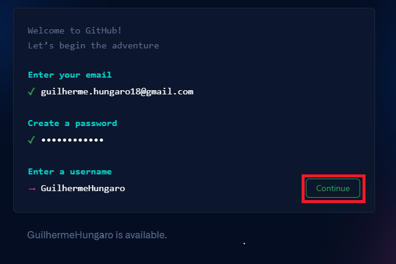
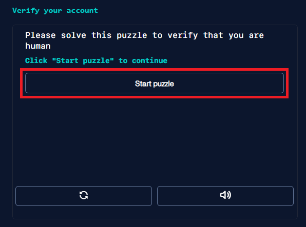
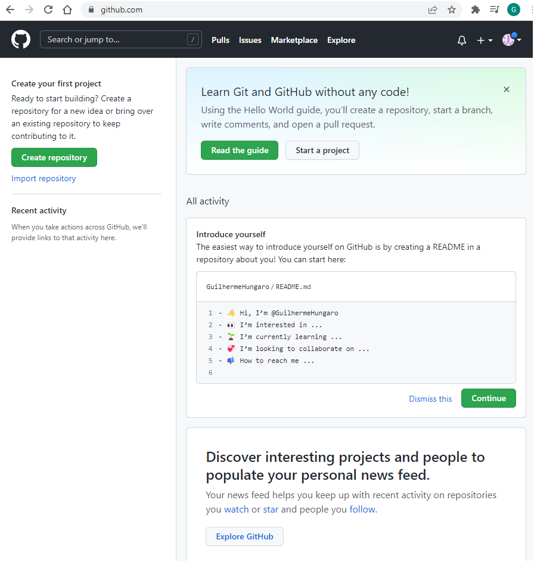
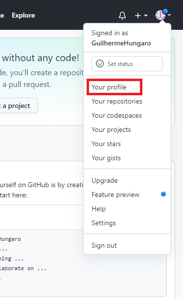
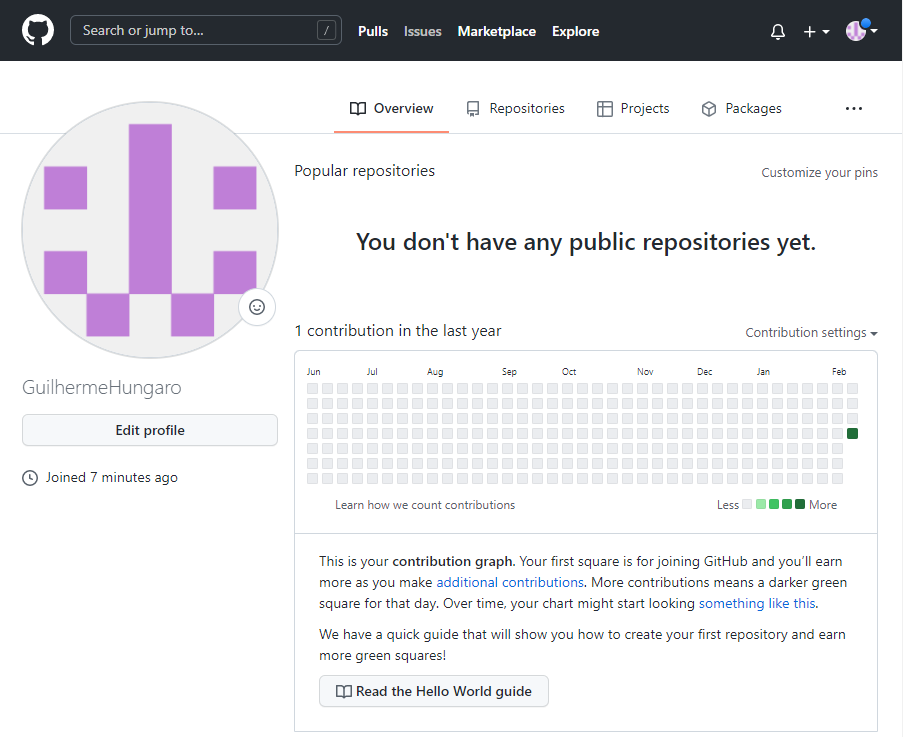
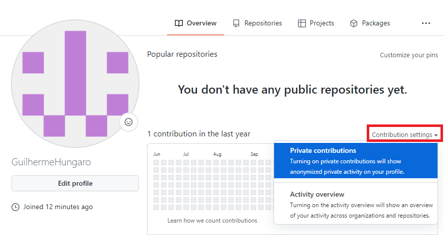

Introdução
****

.. image:: images/github/Logo.png
   :align: center
   :width: 550
   
01.O que é GitHub
====
   
O nome **GitHub** vem da união de duas palavras:

* **Git** - Sistema de versionamento de arquivos. Ou seja, um sistema onde criamos diferentes versões de arquivos. 

* **Hub** - Processo pelo qual se transmite determinada informação.

Com isso, já podemos ter uma ideia de que a plataforma **GitHub** é um espaço onde podemos criar diversas versões diferentes de arquivos para realizar diversas transmissões de informações. 

02.O que o GitHub oferece para os seus usuários
====

**1.** Repositório de textos, com isso podemos criar diversos códigos e programas.  

**2.** É uma plataforma open source, ou seja, de código aberto, portanto muitas aplicações, quase todas, são gratuitas.

**3.** É dividio através de *branches*, ou seja, galhos, cada versão nova de um arquivo é considerado um "galho" do arquivo original.

**4.** É uma excelente rede social, desde a compra do Github pela Microsoft, muitas pessoas tem usado a plataforma para se conectar com outros desenvolvedores, trocar códigos e criar projetos open source.

**5.** Considerado como um Linkedin da área de tecnologia. Como o GitHub disponibiliza diversas ferramentas, é possível criar um perfil totalmente personalizado com seus projetos, portanto cada vez mais pessoas tem aprensentado seu portifólio usando o GitHub.

03.Como criar uma conta
====

Para criar uma conta no Github, siga o passo a passo:

1.Acessar o site github.com

2.Clique em ***Sign up for GitHub***.

3. Preencha os dados, ***e-mail, password, username*** e clique em ***continue***.

4. Após preencher os dados, clique em ***Start puzzle*** para realizar uma verificação de conta. depois clique em ***Create account***.

5.Você irá receber um e-mail com o código de verificação, basta inserir o código.

6.Abrirá uma tela de Welcome to GitHUb, clique em ***Skip personalization***.

7.Pronto, sua conta está criada.

   

04.Acessando o seu perfil
====

No canto superior direito, ao clicar no ícone redondo, clique em ***Your profile***.

Nesta página é possível ver sua foto de perfil, quais repositórios (pastas) você tem, seus projetos, etc.

Clique em ***Contribution settings*** e clique em cima de ***Private contributions***, quando está opção está ligada, sua atividade fica registrada, mesmo que você trabalhe em um projeto privado. 

Uma mensagem escrito ***Visitors will now see your public and anonymized private contributions*** irá aparecer.

