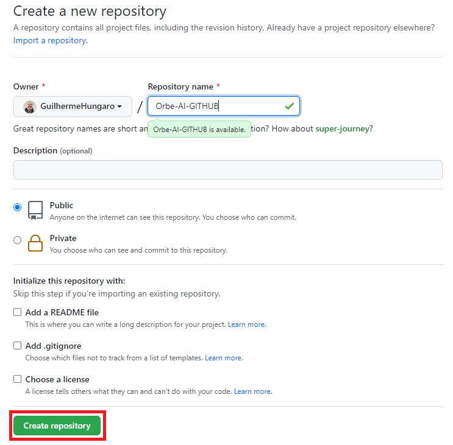

Personalizando seu perfil
****

01.Como personalizar seu perfil
====

Para personalizar o seu perfil pelo menos com o básico, podemos colocar foto de perfil e uma apresentação simples. para isso:

**1.** No canto superior direito clique em **Settings**

.. image:: images/github/settings.png
   :align: center
   :width: 250

**2.** Aqui já podemos alterar algumas informações como foto de perfil, nome, colocar uma bio.

.. image:: images/github/profile_settings.png
   :align: center
   :width: 450

**3.** Após realizar as alterações desejadas, clique em **Update profile**

.. image:: images/github/update_profile.png
   :align: center
   :width: 450

Uma vez com a conta criada, podemos personalizar o perfil para exibir diversas informações, como:

Email, linkedin, outras redes sociais, linguagens de programação mais usadas, entre outros.
Para isso precisamos criar um **README.md** file

02.Criando um README.md file
====

**1.** Clique em **Repositories**

.. image:: images/github/repositories.png
   :align: center
   :width: 450

**2.** Clique em **New**

.. image:: images/github/new_repositories.png
   :align: center
   :width: 450

**3.** Crie um repositório **Com seu nome de perfil**, clique em **Add a README file** e clique em **Create repository**

Este repositório com seu nome de perfil é **especial**, este é uma pasta onde você pode adicionar este **README.md** file e personalizar seu GitHub!

03.Personalizando seu README.md
====

Existem diversas formas de personalizar seu **README.md** file.

03.a.GitHub Stats
----

Uma ferramenta muito interessante é a **GitHub Stats** onde exibe estrelas ganhas, quantos códigos você já criou, problemas resolvidos e contribuições e linguagem mais utilizada.

Para colocar esta ferramenta no seu GitHub cole o código abaixo no seu README.md file, tenha certeza de alterar o **NOME_DO_USUARIO_AQUI** pelo seu nome de usuário no GitHub

.. code-block:: python
   :linenos:
   
   

   <a href="https://github.com/NOME_DO_USUARIO_AQUI">
   
   
   

