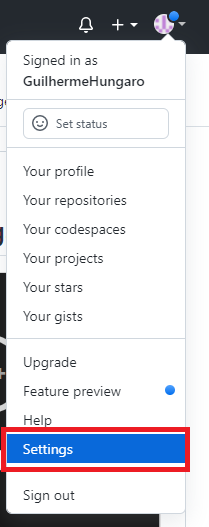
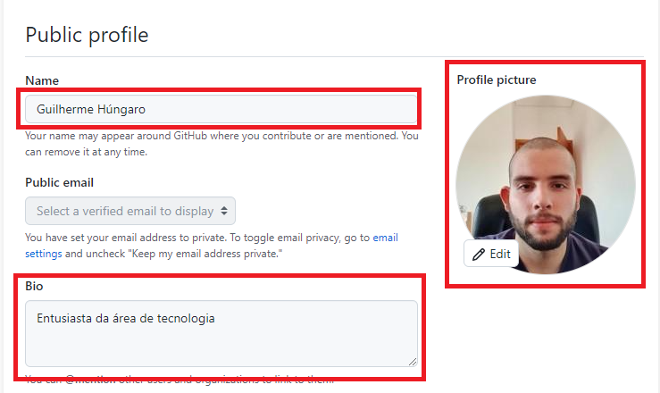
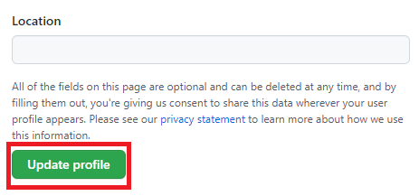
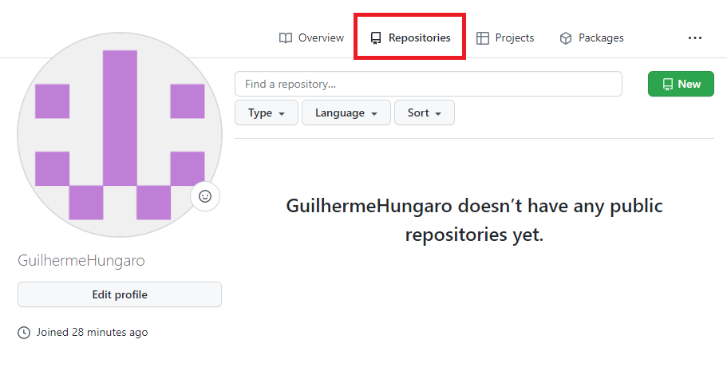
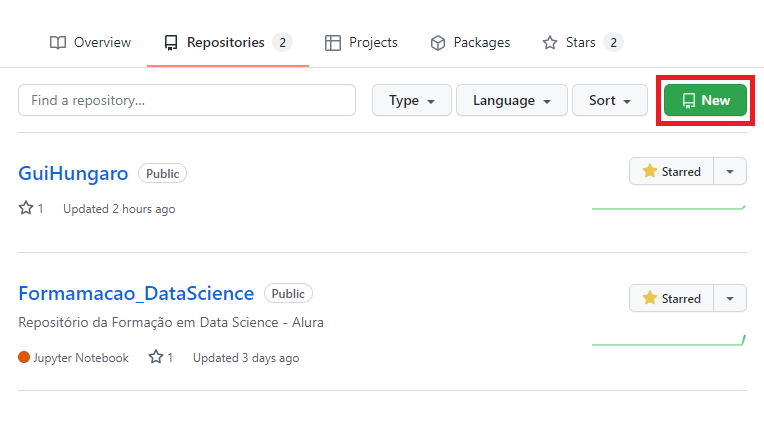
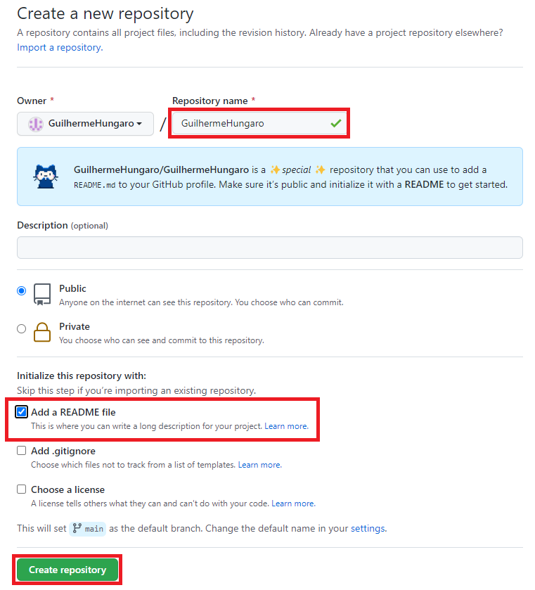
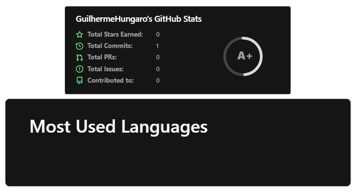
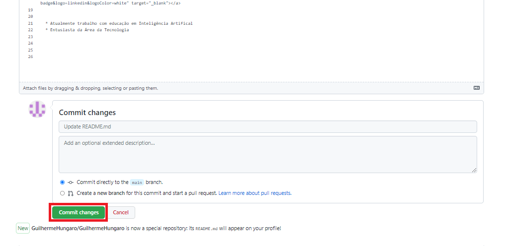
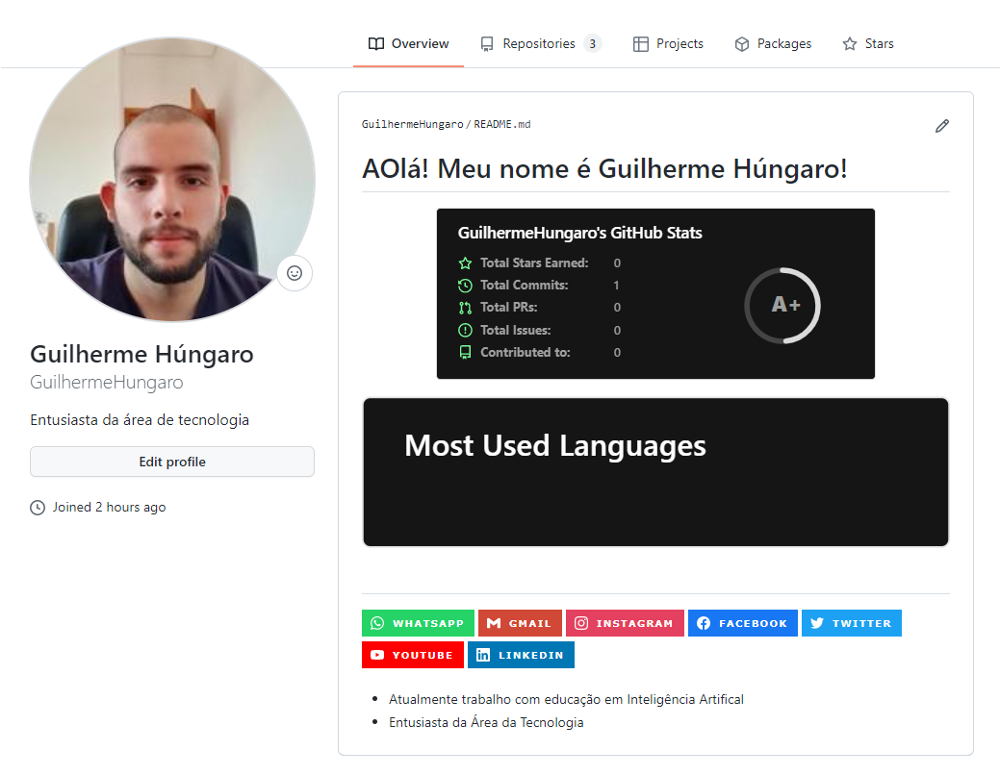

Personalizando seu perfil
****

01.Como personalizar seu perfil
====

Para personalizar o seu perfil pelo menos com o básico, podemos colocar foto de perfil e uma apresentação simples. para isso:

**1.** No canto superior direito clique em **Settings**

**2.** Aqui já podemos alterar algumas informações como foto de perfil, nome, colocar uma bio.

**3.** Após realizar as alterações desejadas, clique em **Update profile**

Uma vez com a conta criada, podemos personalizar o perfil para exibir diversas informações, como:

Email, linkedin, outras redes sociais, linguagens de programação mais usadas, entre outros.
Para isso precisamos criar um **README.md** file

02.Criando um README.md file
====

**1.** Clique em **Repositories**

**2.** Clique em **New**

**3.** Crie um repositório **Com seu nome de perfil**, clique em **Add a README file** e clique em **Create repository**

Este repositório com seu nome de perfil é **especial**, este é uma pasta onde você pode adicionar este **README.md** file e personalizar seu GitHub!

03.Personalizando seu README.md
====

Existem diversas formas de personalizar seu **README.md** file.

03.a.GitHub Stats
----

Uma ferramenta muito interessante é a **GitHub Stats** onde exibe estrelas ganhas, quantos códigos você já criou, problemas resolvidos e contribuições e linguagem mais utilizada.

Para colocar esta ferramenta no seu GitHub cole o código abaixo no seu README.md file, tenha certeza de alterar o **NOME_DO_USUARIO_AQUI** pelo seu nome de usuário no GitHub

.. code-block:: python
   :linenos:
   
   

   <a href="https://github.com/NOME_DO_USUARIO_AQUI">
   
   
   

   
   
03.b.Redes Sociais
---

Podemos utilizar o README.md file para adicionar diversos links estilizados para redes sociais, por exemplo:

* **Whatsapp**

Para adicionar em seu perfil, basta colar o código abaixo e alterar onde está **SEU_NUMERO_AQUI** para o seu número, com código do país e DD, por exemplo, 5511981859166.

.. code-block:: python
   :linenos:
   
   

.. warning::

   Caso o número esteja errado ou não tenha o código do país/DD ele irá dar como impossível de localizar este contato.
   
   
03.b.I.Gmail
++++

Para adicionar em seu perfil, basta colar o código abaixo e alterar onde está **SEU_EMAIL_AQUI** para o seu endereço de e-mail.

.. code-block:: python

   

03.b.II.Instagram
++++

Para adicionar em seu perfil, basta colar o código abaixo e alterar onde está **SEU_INSTAGRAM_AQUI** para o seu Instagram.

.. code-block:: python

  

03.b.III.Facebook
++++

Para adicionar em seu perfil, basta colar o código abaixo e alterar onde está **SEU_FACEBOOK_AQUI** para o seu Facebook.

.. code-block:: python

  

03.b.IV.Twitter
++++

Para adicionar em seu perfil, basta colar o código abaixo e alterar onde está **SEU_TWITTER_AQUI** para o seu Twitter.

.. code-block:: python

  

03.b.V.Youtube
++++

Para adicionar em seu perfil, basta colar o código abaixo e alterar onde está **SEU_CANAL_YOUTUBE_AQUI** para o link do seu canal do Youtube.

.. code-block:: python

  

03.b.VI.Linkedin
++++

Para adicionar em seu perfil, basta colar o código abaixo e alterar onde está **SEU_LINKEDIN_AQUI** para o seu Linkedin.

.. code-block:: python

  

04.Finalizando a personalização
====

Desta forma será possível criar um perfil personalizado que chame a atenção quando as pessoas entrarem.

Você também pode colocar uma apresentação pessoal bem bacana.

Após realizar as alterações desejadas em seu arquivo **README.md** file, clique em **Commit changes** para enviar essas alterações e ter seu perfil personalizado

   
Este será o resultado:

