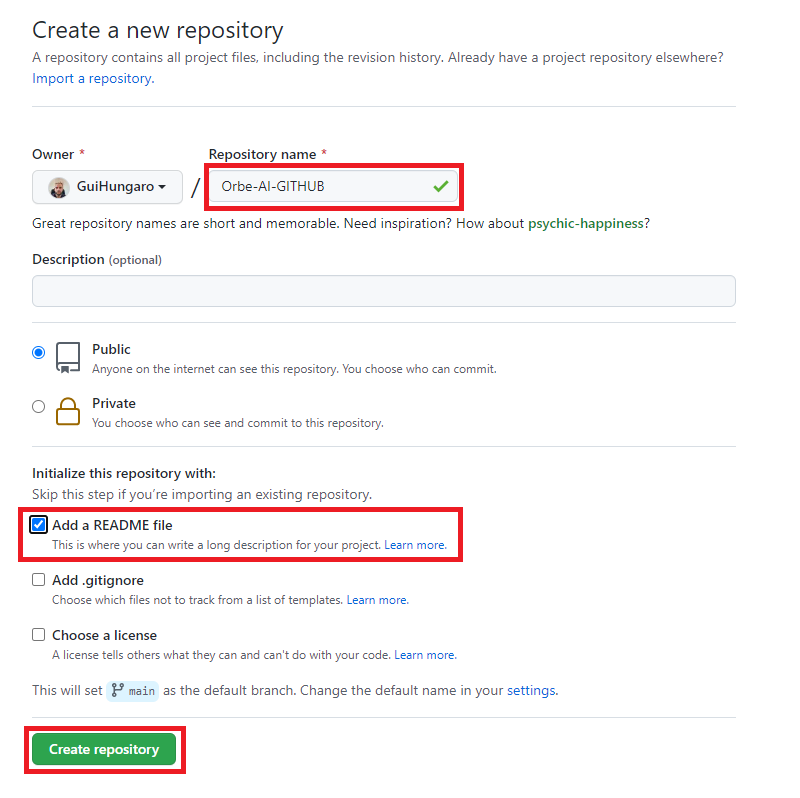
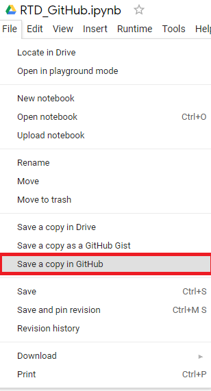
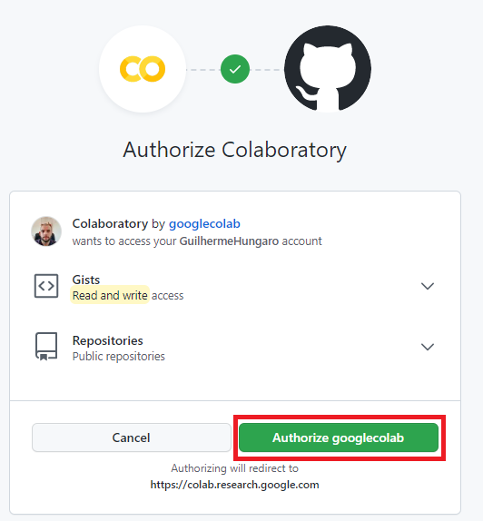
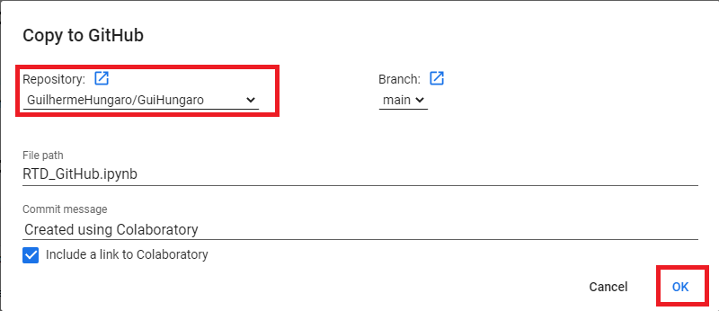

Trabalhando com o GitHub
****

01.Como criar pastas/diretórios
====

Para criar pastas/diretórios:

1.Clique em **Repositories** 

.. image:: images/github/repositories.png
   :align: center
   :width: 450

2.Clique em **New** 

.. image:: images/github/new_repositories_2.png
   :align: center
   :width: 350

3.Escolha o nome do seu repositório, selecione Add a README file e clique em **Create repository**.

02.Como sincronizar o GitHub com o Google Colaboratory
====

Para sincronizar o GitHub com o Google Colaboratory:

1. Dentro do Google Colaboratory clique em **File**.

.. image:: images/github/file.png
   :align: center
   :width: 450

2.Clique em **Save a copy in GitHub**.

3.Uma página irá abrir, clique em **Authorize googlecolab**.

4.Selecione o repositório desejado e clique em **Ok**.

5.Pronto, você já sincronizou o GitHub com o Google Colaboratory.
