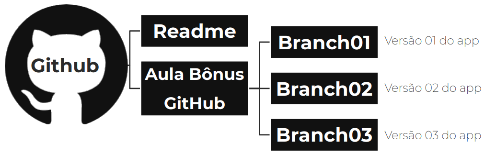
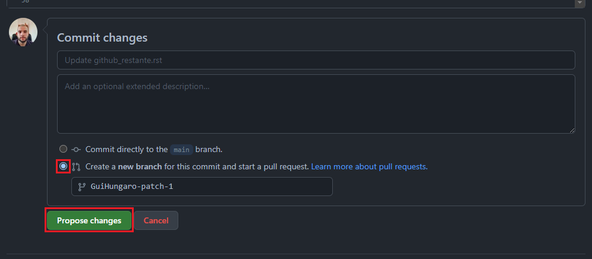
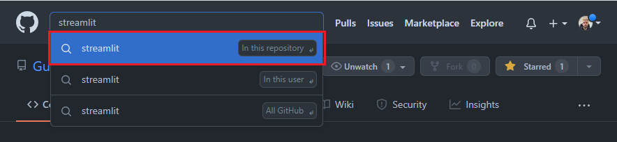
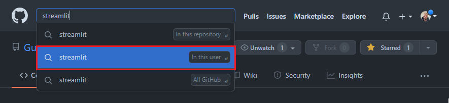
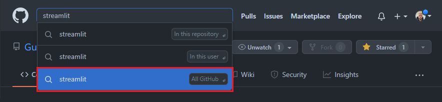
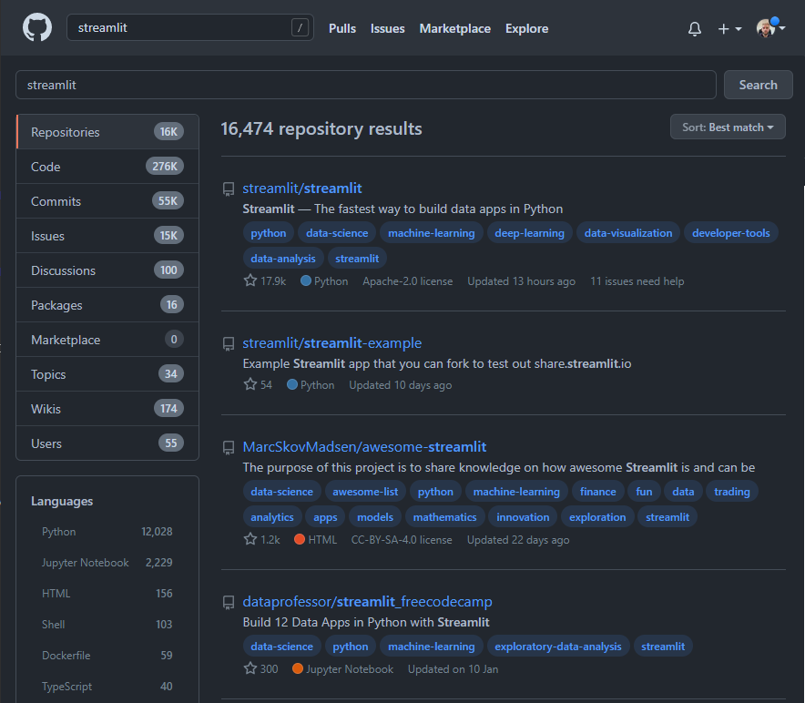
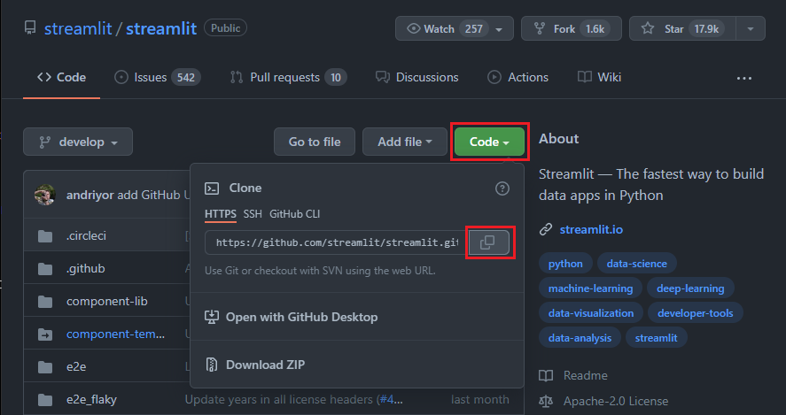
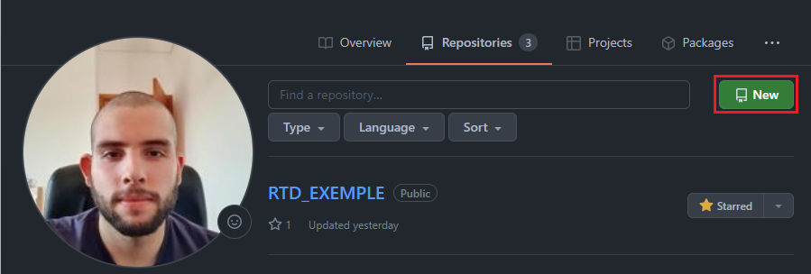
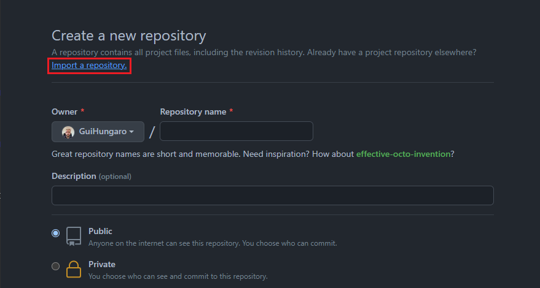
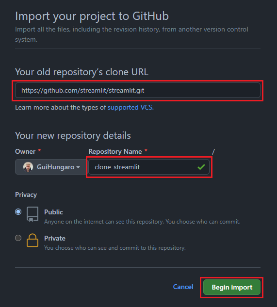

Trabalhando com o GitHub
****

01.Como criar pastas/diretórios
====

Para criar pastas/diretórios:

1.Clique em **Repositories** 

.. image:: images/github/repositories.png
   :align: center
   :width: 450

2.Clique em **New** 

.. image:: images/github/new_repositories_2.png
   :align: center
   :width: 400

3.Escolha o nome do seu repositório, selecione **Add a README file** e clique em **Create repository**.

.. image:: images/github/create_repositories.png
   :align: center
   :width: 350

02.Como sincronizar o GitHub com o Google Colaboratory
====

Para sincronizar o GitHub com o Google Colaboratory:

1. Dentro do Google Colaboratory clique em **File**.

.. image:: images/github/file.png
   :align: center
   :width: 450

2.Clique em **Save a copy in GitHub**.

.. image:: images/github/save_copy_github.png
   :align: center
   :width: 200

3.Uma página irá abrir, clique em **Authorize googlecolab**.

.. image:: images/github/authorize_googlecolab.png
   :align: center
   :width: 350

4.Selecione o repositório desejado e clique em **Ok**.

.. image:: images/github/ok_google.png
   :align: center
   :width: 450

5.Pronto, você já sincronizou o GitHub com o Google Colaboratory.

04.O que é um Branch
====

Branch significa ramo, e é através dessa ideia de ramos que podemos realizar versionamentos dos nossos repositorios, aplicativos e projetos.

Isso permite com que sejam criados versões diferentes para testar soluções de formas rápidas e eficientes sem alterear o repositório original.

Para criar um novo Branch de seu projeto é muito simples, basta na hora de salvar a alteração desejada clicar em **Create a new branch for this commit and start a pull request**. Depois só escolher o nome desejado desse novo branch e clicar em **Propose changes**

   
05.Como buscar códigos e clonar repositórios
====

05.a.Como buscar códigos
----

O GitHub é uma rede social utilizada por milhões de usuários de diversas partes do mundo. Isso é algo muito rico pois podemos trocar códigos e informações com diversas pessoas.

Para pesquisar códigos, repositórios entre outros é só clicar no canto superior direito na parte de **Search or jump to...** 

Depois só digitar o conteúdo de interesse. Nesse momento você terá três opções: 

1. *In this repository* - Ao clicar nesse botão você irá pesquisar o termo escolhido no repositório que você está. Isso pode ser muito útil na hora de encontrar algum comando específico utilizando apenas um termo. 

2. *In this user* - Este comando busca o termo escolhido em todo o seu usuário, ou seja, facilita muito na hora de encontrar algum arquivo/repositório desejado

3. *All GitHub* - Este botão irá pesquisar o termo desejado em todo o GitHub, é uma ferramenta realmente muito útil na hora de pesquisar novos repositórios, bibliotecas, usuários, etc.

Após pesquisar o termo escolhido em todo o GitHub, você irá para uma página cheia de informações sobre a pesquisa, como por exemplo as linguagens mais usadas, a quantidade de repositórios, a quantidade de linhas de códigos, fórum, etc.

Essa ferramenta de busca é fundamental na hora de **clonar repositórios**.

05.b.Como clonar repositórios
----

Clonar repositórios é uma prática comum e saudável dentro da comunidade GitHub. Como só é permitido a clonagem de repositórios públicos não precisa se preocupar com questão de direitos autorais/legais.

Imagine a situação onde você encontrou um repositório de uma ferramenta essencial para o projeto que você está desenvolvendo mas um dia de repente você vai olhar e esse repositório foi deletado pelo dono. 

Para não passar por um problema desse uma solução muito simples é clonar o repositório, para isso basta seguir o passo a passo a seguir:

1. Vá no repositório desejado, clique em **Code** e depois copie o link.

2. Vá em seus repositórios e clique em **New**.

3. Clique em **Import a repository**.

4. Coloque o link copiado do outro repositório, escolha um nome e clique em **Begin import**.

.. warning::

    Dependendo do tamanho do repositório escolhido para clonar, a importação pode levar alguns minutos, porém não é preciso deixar a janela aberta, quando a importação estiver pronta eles irão enviar um aviso por e-mail.

Pronto! Assim que terminar de carregar seu repositório irá automaticamente aparecer na parte de **Your repositories**.
