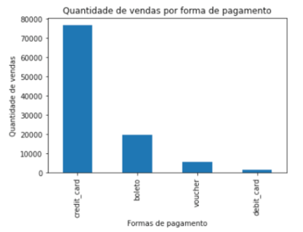
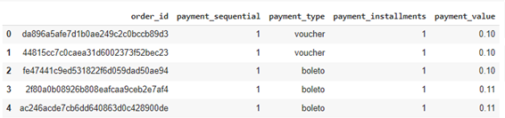
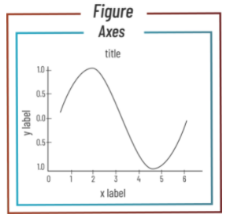

Gráfico de barras
************

01.Quando usar um gráfico de barras
==========

•	Usamos um gráfico de barra **quando precisamos comparar quantidades de categorias diferentes**.

 
02.Preparando os dados
========

02.a.Importando as bibliotecas necessárias
--------

.. code-block:: python
   :linenos:
   
   #Importando as bibliotecas necessárias
   import pandas as pd
   import matplotlib.pyplot as plt

02.b.Criando o DataFrame
--------

Para este grpafico usaremos uma base de dados ("olist_order_payments_dataset.xlsx") sobre pagamentos de pedidos da empresa de varejo online Olist.

.. code-block:: python
   :linenos:
   
   #Criando o DataFrame
   df = pd.read_excel("/content/oilist_order_payments_dataset.xlsx")
   
.. code-block:: python
   :linenos:
   
   #Visualizandoo DataFrame
   df.head()
      
**Este é o resultado:**

.. code-block:: python
   :linenos:
   
   #Verificando o formato do DataFrame
   df.shape
   
**Este é o resultado:**

.. code-block:: python
   
   >>> (102698, 5)

.. note::
  Por uma questão de didática fizemos pequenas alterações no dataset que retiramos do site da Kaggle.
  

 
03.Construindo um gráfico de barras
========

.. code-block:: python
   :linenos:
   
   #Criar o objeto figure e axes
   fig, ax_01 = plt.subplots()

.. code-block:: python
   :linenos:
   
   #Escolher os dados e somá-los para plotar o gráfico
   df.payment_type.value_counts().sort_values(ascending=False).plot(kind="bar", ax=ax_01)

.. code-block:: python
   :linenos:
   
   #Customizando o Axes
   ax_01.set_title("Formas de Pagamento")
   ax_01.set_xlabel("Categorias de Pagamento")
   ax_01.set_ylabel("Quantidade vendida em R$")

.. code-block:: python
   :linenos:
   
   #Exibindo o gráfico
   plt.show()

**Este é o resultado:**

.. note::
  
  1. Usar o método e os parâmetros ``figsize(altura,largura)`` se necessário.
  2. Repare que o gráfico de barras nos mostra a soma de cada categoria e por este motivo usamos o método value_counts() para fazer a soma de cada categoria.
 
 
03.a.Invertendo a ordem das barras
-------

Caso queira inverter a ordem das barras para a de maior valor para a de menor valor (ou vice e versa):
basta usar o método ``.sort_values(ascending=True)`` e usar o parâmetro ``ascending``.

03.a.i.Valores crescentes
++++++

.. code-block:: python
   :linenos:
   
   df.Nome_Da_Variavel.value_counts().sort_values(ascending=True).plot(kind='bar', ax=ax_01)

03.a.ii.Valores decrescentes
++++++

.. code-block:: python
   :linenos:
   
   df.Nome_Da_Variavel.value_counts().sort_values(ascending=False).plot(kind='bar', ax=ax_01)

03.b.Barras horizontais
-------

Para realizarmos um gráfico de barra horizontal, fazemos exatamente os mesmos passos para construir um gráfico de barras vertical, apenas alteramos o valor do parâmetro kind para ``kind='barh'``.

df.nome_variavel.value_counts().plot(kind='barh', ax=ax_01)

.. code-block:: python
   :linenos:
   
   #Criar o objeto figure e axes
   fig, ax_01 = plt.subplots()

.. code-block:: python
   :linenos:
   
   #Escolher os dados e somá-los para plotar o gráfico de barras horizontais
   df.payment_type.value_counts().sort_values(ascending=False).plot(kind="barh", ax=ax_01)

.. code-block:: python
   :linenos:
   
   #Customizando o Axes
   ax_01.set_title("Formas de Pagamento")
   ax_01.set_xlabel("Quantidade vendida em R$")
   ax_01.set_ylabel("Categorias de Pagamento")

.. code-block:: python
   :linenos:
   
   #Exibindo o gráfico
   plt.show()

**Este é o resultado:**

.. image:: images/grafico/grafico_barrah.png
   :align: center
   :width: 550
   
.. note::
   
   Lembrar de adequar a legenda dos eixos X e Y.
