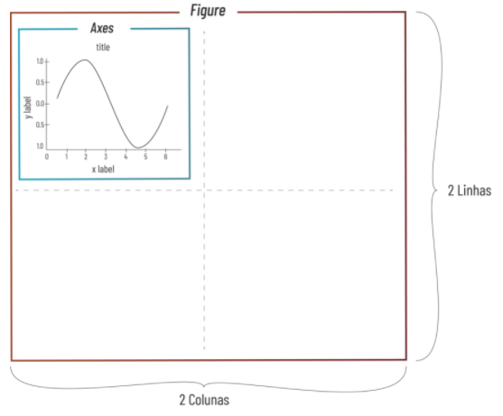
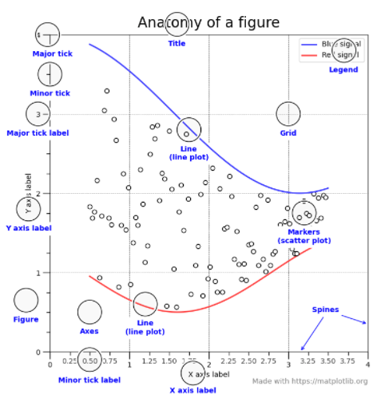
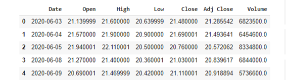
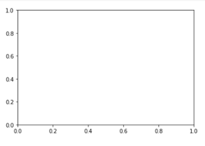
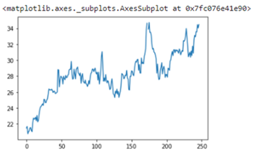
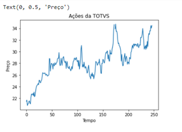
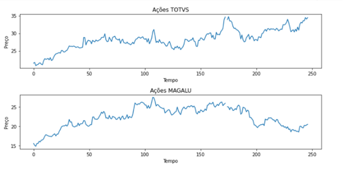

Introdução
************

Matplotlib é uma das bibliotecas mais importantes de visualização de dados com Python, pois muitos outras bibliotecas de gráficos são baseadas nesta biblioteca.
Por isso é tão importante aprendermos o seu funcionamento.

01.Hierarquia de objetos na biblioteca Matplotlib
==========

Na biblioteca Matplotlib temos vários objetos e cada um possui a sua hierarquia. Começamos da parte mais externa para a parte mais interna desta hierarquia:

   
•	``Figure``: objeto mais externo e que comporta um ou vários Axes.
•	``Axes``: objeto que de fato é o nosso gráfico (plot).

•	Outros objetos: dentro do Axes (gráfico) temos inúmeros outros elementos como: títulos, legendas e etc:

 
02.Abordagens para construir um gráfico (``plot``) com Matplotlib
==========

02.a.Abordagem direta (``stateful``)
-------------

•	Abordagem direta é a mais simples e porém a mais limitada, pois nos permite trabalhar com apenas uma figure e um axes de cada vez.

•	Esta aula já possui muitos conceitos e para não adicionar um conteúdo que não usaremos não irei explicar nada sobre a abordagem direta (stateful), mas comento apenas para falar que existe.

02.b.Abordagem orientada a objeto (``stateless``)
----------

A abordagem orientada a objetos é um pouco mais complexa de entender no início, mas depois entenderemos os grandes benefícios como:

•	Grande possibilidade de opções de customizar os gráficos.

•	Facilitar o aprendizado de outras bibliotecas que aprenderemos no futuro, pois estas se baseiam no Matplotlib.

03.Construindo um gráfico com a abordagem orientada a objeto
========

Antes de começarmos o passo a passo para construirmos os gráficos, vamos importar a biblioteca Pandas e criar o nosso DataFrame.
Faremos isso a partir de um dataset de os valores das ações na bolsa de valores e que pode ser encontrado no site do Yahoo! Finanças:

.. code-block:: python
   :linenos:
   
   #Importando a biblioteca Pandas e apelidando de pd
   import pandas as pd

.. code-block:: python
   :linenos:
   
   #Criando um DataFrame a partir do nosso Dataset
   df_totvs = pd.read_csv("/content/TOTS3.SA.csv")
   
.. code-block:: python
   :linenos:
   
   #Visualizando o DataFrame
   df_totvs.head()
   
**Este é o resultado:**

 
03.a.Importando a biblioteca Matplotlib
------

Para importar a biblioteca ``Matplotlib`` fazemos da seguinte forma:

.. code-block:: python
   :linenos:
   
   #Importando a biblioteca matplotlib e chamando de plt
   import matplotlib.pyplot as plt

Repare que após o nome da biblioteca ``matplotlib`` há o módulo ``pyplot`` que é a parte da biblioteca que trabalha para plotar gráficos com Python, dai o nome python + plot (pyplot)
 
03.b.Criando os objetos Figure e Axes
-----

Lembrando que:

•	``figure`` é o objeto de maior hierarquia (mais externo) na estrutura.

•	``axes`` é de fato o nosso gráfico (plot) e dentro de uma figure podemos ter um ou vários axes.

.. image:: images/grafico/figura_axe.png
   :align: center
   :width: 550
 
 
Para criarmos os objetos ``figure`` e ``axes`` usamos o método ``.subplots()`` do pyplot desta forma:

.. code-block:: python
   :linenos:
   
   fig, ax = plt.subplots()

**Este é o resultado:**

.. warning::

  Repare que como não usamos nenhum parâmetro do método ``.subplots()`` por ``default`` (padrão) é criado apenas uma linha e uma coluna, ou seja, há espaço para apenas um axes.

03.c.Plotar um gráfico
-----

Para plotar o gráfico usamos o método ``.plot`` do Pandas e depois alocamos este gráfico dentro do objeto ``ax (axes)``. 

Desta forma:

01.Criar os objetos fig e ax.
+++++++++

.. code-block:: python
   :linenos:
   
   fig. ax_01 = plt.subplots()

02.Plotar o gráfico com o método .plot() a partir do nosso DataFrame (df) e armazená-lo dentro do objeto ax.
++++++++++

.. code-block:: python
   :linenos:
   
   df.nome_variavel.plot(ax=ax_01)
   
03.Veja o exemplo de plotar um gráfico:
+++++++

.. code-block:: python
   :linenos:
   
   fig. ax_01 = plt.subplots()

.. code-block:: python
   :linenos:
   
   df.Close.plot(ax=ax_01)
   
**Este é o resultado:**
   

 
04.Customizando o gráfico
========

O gráfico é o próprio objeto ``ax_01 (axes)`` e por isso iremos trabalhar diretamente nele.

Estes são alguns comandos de customização:

•	``.set_title()`` - para adicionar título ao gráfico.

•	``.set_xlabel()`` - para adicionar nome do eixo x.

•	``.set_ylabel()`` - para adicionar nome do eixo y

•	``.plt.show()`` - para mostrar o gráfico.

.. note:: 

  Repare que mesmo sem este método ``plt.show()`` o gráfico é apresentado, mas isso ocorre pois o Jupyter Notebook já pressupõem que iremos apresentar o gráfico. 
  Porém, mais a diante quando não estivermos usando mais o Jupyter Notebook precisaremos deste método para poder mostrar o gráfico.

04.a.Veja o exemplo de como customizar o gráfico
--------

.. code-block:: python
   :linenos:
   
   #Criando os objetos figure (fig) e axes (ax_01) com o método subplots()
   fig, ax_01 = plt.subplots()

.. code-block:: python
   :linenos:
   
   #Plotar o gráfico a partir do DataFrame e alocá-lo no objeto ax_01 (axes)
   df.Close.plot(ax=ax_01)

.. code-block:: python
   :linenos:
   
   #Adicionando título ao gráfico
   ax_01.set_title("Ações da TOTVS")

.. code-block:: python
   :linenos:
   
   #Adicionando nome ao eixo x
   ax_01.set_xlabel("Tempo")

.. code-block:: python
   :linenos:
   
   #Adicionando nome ao eixo y
   ax_01.set_ylabel("Preço")
   
**Este é o resultado:**

   
   
05.Construindo uma figure com dois axes.
==============

Veremos agora como construir uma ``figure`` com dois ``axes``, ou seja, dois gráficos:

.. code-block:: python
   :linenos:
   
   #Criando um segundo DataFrame.
   df_magalu = pd.read_csv("/content/MGLU3.SA.csv")

.. code-block:: python
   :linenos:
   
   #Para ter espaço para os dois gráficos axes iremos deixar a figure com duas linhas e uma coluna. 
   #Para isso, usaremos os parâmetros número de linhas nrows e número de colunas ncols.
   fig, (ax_01,ax_02) = plt.subplots(nrows=2, ncols=1)

.. code-block:: python
   :linenos:
   
   #Plotando dois gráficos e alocando-os nos respectivos axes (ax_01 e ax_02).
   df.Close.plot(ax=ax_01)df_magalu.Close.plot(ax=ax_02)

.. code-block:: python
   :linenos:
   
   #Adicionando títulos com o método set_title().
   ax_01.set_title("Ações TOTVS")ax_02.set_title("Ações MAGAZINE LUIZA")

.. code-block:: python
   :linenos:
   
   #Adicionando nome ao eixo x com o método set_label().
   ax_01.set_xlabel("Tempo")ax_02.set_xlabel("Tempo")

.. code-block:: python
   :linenos:
   
   #Adicionando nome ao eixo y com o método set_label().
   ax_01.set_ylabel("Preço")ax_02.set_ylabel("Preço")

.. code-block:: python
   :linenos:
   
   #Ajustando o layout com o método tight_layout().
   plt.tight_layout()

.. code-block:: python
   :linenos:
   
   #Para alterarmos o tamanho da figura usamos o parâmetro figsize.
   fig, (ax_01,ax_02) = plt.subplots(nrows=2,ncols=1, figsize=(largura, altura))

**Este é o resultado:**

