Aprendizado supervisionado
****

01.O que é aprendizado supervisionado
====

Dentro de nosso DataFrame, cada coluna é um atributo, e eles podem ser separados em:

* **Atributos preditores ou descritores**

São aqueles que nos ajudam a descrever o atributo alvo, é com esses atributos que o nosso modelo de ML irá aprender para chegar ao tributo alvo.

* **Atributo alvo**

É aquele atributo que com base nos atributos preditores o nosso modelo de ML irá encontrar, ou seja, é aquele atributo que queremos descobrir.

Tendo isso em mente, aprendizado supervisionado é justamente quando nos fornecemos o atributo alvo na hora da modelagem do algoritmo de ML

Imagine o seguinte exemplo, nós temos os seguintes atributos descritivos:

1. Peso da pessoa
2. Altura da pessoa

E com esses dados queremos descobrir o **tamanho da calça**, ou seja, nosso atributo alvo.

Na hora de realizar a modelagem deste algoritmo, em nossa base de teste iremos fornecer tanto os atributos descritivos (x_teste) quanto o atributo alvo (y_teste). 

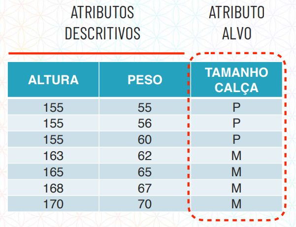

Desta forma, ao fornecer o atributo alvo teste nós estamos "supervisionando" o algoritmo durante a modelagem para que ele saiba as respostas do atributo alvo. 

Após o treino, este algoritmo se torna um modelo e está pronto para predizer novos tamanhos de calça com base apenas nos atributos descritivos. 

02.Tarefa de classificação
====

02.a.O que é tarefa de classificação
----

Dentro do aprendizado supervisionado temos a tarefa de classificação.

Quando estamos trabalhando com a tarefa de classificação o nosso atributo alvo é justamente uma classe, por exemplo tamanho da calça, crédito aprovado ou reprovado, paciente está doente ou pode ter alta.

Ou seja, em uma tarefa de classificação, nosso modelo de ML irá, através das análises dos atributos descritivos, predizer nosso atributo alvo que necessariamente será uma categoria, dado nosso problema de negócio. 

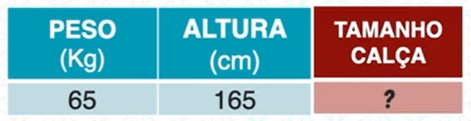
   

02.b.Algoritmos de classificação
----

02.b.I.Algoritmo K-NN
++++

**K-NN** vem do inglês que significa "K-Nearest Neighbors" ou seja, **"K-Vizinhos mais Próximos"** e é o algoritmo de aprendizagem de máquina mais simples. 

**K** é a quantidade de vizinhos que vamos levar em consideração e **NN** são justamente os pontos ("vizinhos") mais próximos do atributo alvo que queremos predizer.

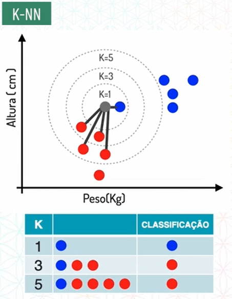

Por exemplo, dado que temos dois atributos descritivos, peso e altura, e o nosso atributo alvo é o tamanho da calça. 

Nós iremos realizar a modelagem desse algoritmo, lembrando que é um algoritmo de aprendizagem supervisionada, então iremos fornecer os atributos descritivos e alvo nessa etapa.

Após a modelagem, nossso modelo de classificação irá ver o atributo alvo a ser predito e classificar com base nos vizinhos mais próximos que colocamos para ele levar em consideração, que no exemplo abaixo é 5. 

.. only:: html

   .. image:: images/ML/knn.gif

Ou seja, **no algoritmo K-NN a maioria das classes dos vizinhos irá ditar a nossa classificação.**

Portanto quando o K for igual a 1, ele irá buscar somente o primeiro vizinho mais próximo, que em nosso exemplo é o tamanho M. 

Caso o K seja igual a 3, ele busca os três vizinhos mais próximos e verifica quais estão em maior quantidade, em nosso caso, será o tamanho P. O mesmo vale para K igual a 5 neste exemplo.

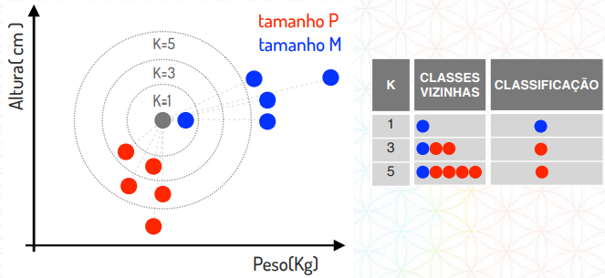

.. note::

   Em nosso exemplo só usamos os valores de K igual a números ímpares, porém no caso de K for um número par, e as classes estiverem equilibradas, duas classes azuis e duas classes vermelhas por exemplo, o que irá ditar a classificação é a qual dessas duas classes está mais próximo.
   

02.b.II.Cálculo de distãncia
++++

Vale a pena ressaltar que o K-NN realiza vários tipos de cálculos, porém aqui iremos focar somente no cálculo de distância euclidiana apenas para você entender o funcionamento do algoritmo.

Porém não é necessário fazer essas contas, o computador irá fazer em poucas linhas de código no jupyter notebook.

Existe um triângulo chamado triângulo retângulo, onde um dos ângulos dele é de 90 graus. 

O lado contrário à esse ângulo de 90 graus é chamado de hipoteusa, no exemplo abaixo o **lado a**. Para descobrir tamanho desta hipotenusa temos as seguintes fórmulas:

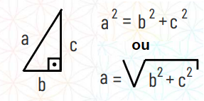

Na prática, esse cálculo ficaria assim:

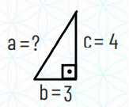

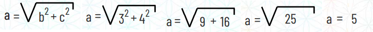
   
Retomando ao exemplo de classificação de tamanhos de calças, imagine que nós temos:

* Uma pessoa com 65kg e 165cm que veste calça do tamanho P, classificada em vermelho em nosso gráfico

* Uma pessoa com 67kg e 185cm que queremos classificar qual o tamanho de calça ela usa.

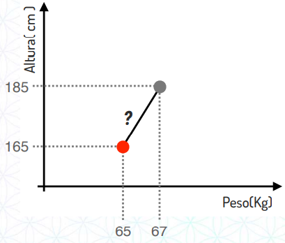

Repare que essa distância entre pontos é justamente o cálculo da hipotenusa que mostramos no tópico anterior.

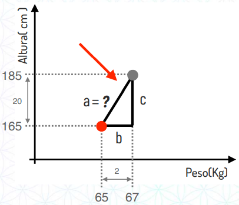

Para resolver qual a distância entre esses dois pontos o algoritmo irá  substituir o valor de b e de c e realizar o cálculo:

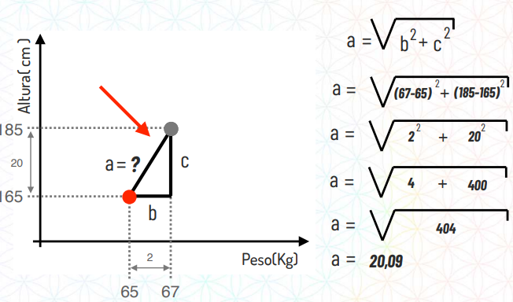
   
Essa é uma das formas que o K-NN utiliza para calcular a distância entre os pontos vizinhos e ver qual é o mais próximo, daí que vem o nome.

Conforme dito anteriormente o nome dessa distância é a distância euclidiana. 
O K-NN trabalha com diversos tipos de distância, a melhor a se utilizar depende dos seus dados e do problema de negócio abordado. 

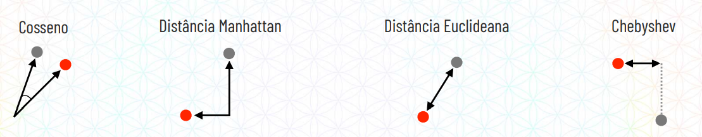

02.c.Avaliação de modelos de classificação
----

02.c.I.Considerar o contexto
++++

O primeiro passo é considerar o contexto em que se está trabalhando, por exemplo:

Caso o modelo classifique se a pessoa tem um determinado tipo de doença ou não, a dosagem de um remédio, faça um diagnóstico importante, ele precisa ter uma altíssima taxa de acerto, pois é a vida de uma pessoa que está em risco. 

Já se for um modelo para predizer se um banco deve liberar empréstimo ou não, a taxa de acerto não precisa ser tão alta por não ter a vida de nínguem em risco, ela só precisa ser mais alta que a taxa de acerto do banco e fazer sentido em nossa aplicação.

02.c.II.Número de classes
++++

O segundo passo é considerar o número de classes que temos dentro da nossa base de dados, por exemplo, imagine que temos três cartas, cada uma de um naipe, podendo ser Ouros, Espadas ou Copas.

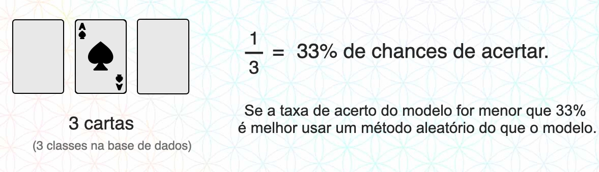

Tendo essas informações, se nós dermos um chute para descobrir qual o naipe da carta com elas viradas para baixo, temos 33% de chance de acerto. Se a taxa de acerto do modelo for menor que 33% não vale a pena ter um modelo de Machine Learning para resolver esse problema.

02.c.III.Matriz de confusão
++++

A Matriz de Confusão é uma ferramenta importante para avaliar erros e acertos do modelo, o seu nome se refere à confusão (predições erradas) que o modelo faz ao classificar os atributos alvos.

Imagine um banco que utiliza um modelo de Machine Learning para classificar se irá liberar crédito ou não:

* Se a pessoa não pagar o empréstimo é classificada como **INADIMPLENTE**

* Se a pessoa pagar o empréstimo é classificada como **ADIMPLENTE**

Após o modelo do banco classificar a base de teste, iremos rodar uma matriz de confusão para verificar os acertos. 

Na matriz de confusão temos em verde as classes que o modelo acertou, e em vermelho as classes que o modelo errou.

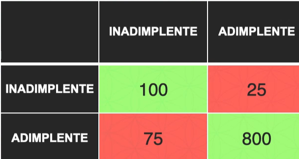

De acordo com a matriz de confusão o modelo do banco classificou:

* 100 clientes foram preditos **CORRETAMENTE** como inadimplente

* 800 clientes foram preditos **CORRETAMENTE** como adimplente

* 25 clientes foram preditos **ERRADOS** como adimplente, mas são inadimplente

* 75 clientes foram preditos **ERRADOS** como inadimplente, mas são adimplente

Antes de entendermos se esse modelo faz sentido para nosso problema de negócio, é importante entender a nomenclatura da Matriz de confusão.

**Nomenclatura**

A Matriz de confusão possui cada quadrante com um nome, a lógica por trás do nome funciona da seguinte maneira:

* O modelo classificou com a classe “X”?
   
   Responda com Positivo ou Negativo

* O modelo previu corretamente?
  
   Responda com Verdadeiro ou Falso

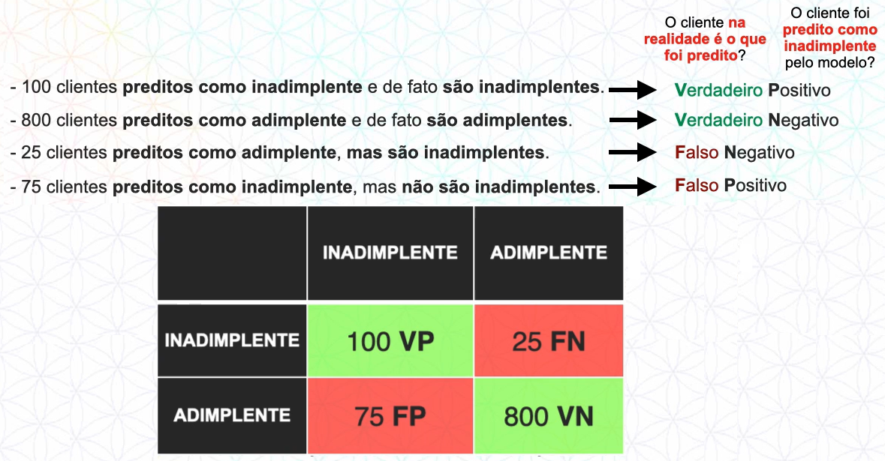

**Taxa de acerto**

Graças as métricas de avaliação que a matriz de confusão disponibiliza para a gente é possível calular a taxa de acerto (acurácia) do modelo. 

Para calcular a acurácia nós fazemos os acertos divididos pelo total, neste caso será:

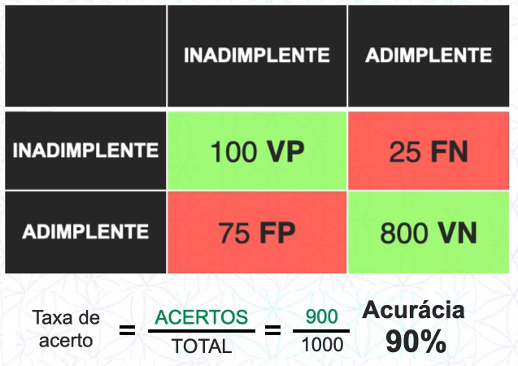

**Precisão** 

Graças as métricas de avaliação que a matriz de confusão disponibiliza para a gente é possível calular a precisão do modelo. 

Para calcular a precisão nós fazemos as classes preditas como VP dividido por VP + FP, em nosso exemplo será:

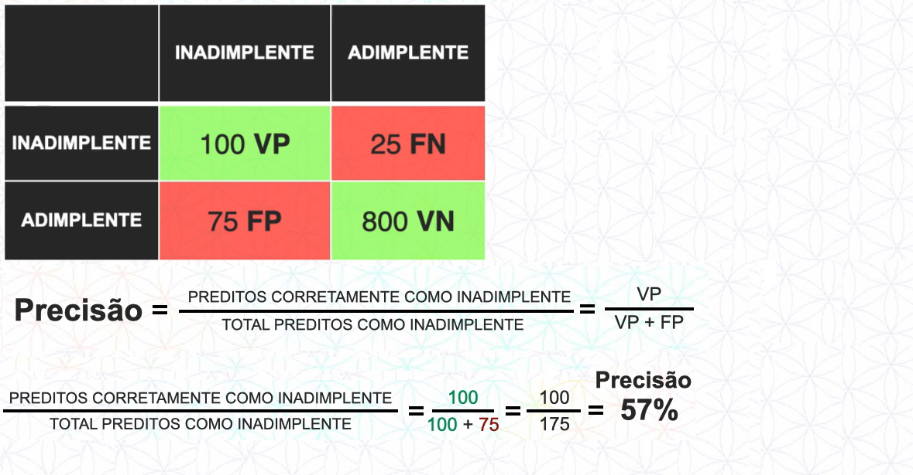

Após ter os números da taxas de acerto, precisão basta analisar numericamente junto ao nosso problema de negócio podemos dizer se esse modelo é eficaz ou não.

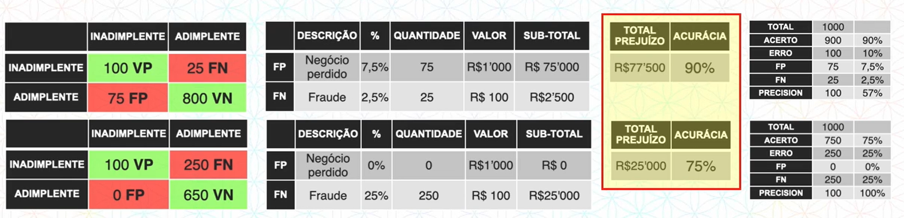

03.Tarefa de regressão
====

03.a.O que é tarefa de regressão
-----

Dentro do aprendizado supervisionado temos a tarefa de regressão.

Quando estamos trabalhando com a tarefa de regressão o nosso atributo alvo é necessariamente um número. 
Por exemplo qual o **valor** de crédito um banco pode aprovar para um cliente, qual o **preço** de um imóvel, produto, etc.

Ou seja, em uma tarefa de regressão, nosso modelo de Machine Learning irá, através das análises dos atributos descritivos, predizer nosso atributo alvo que será obrigatóriamente um número, dado nosso problema de negócio.

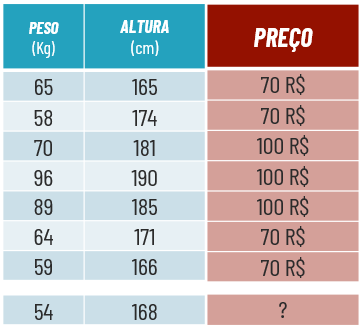
   

03.b.Algoritmos de regressão
----

03.b.I.Algoritmo Regressão Linear
++++

O algoritmo Regressão Linear tem o esse nome por conta dos passos a passos que ele realiza para predizer um número. 

Basicamente, na hora da modelagem os dados de treino são colocados em um gráfico. A partir disso nosso modelo entende a correlação entre os dados e traça uma reta que tenha o **menor erro** possível em relação aos dados. 
Dessa forma, ao predizer um dado novo, será calculado em qual posição da reta se encaixa e assim, encontrar um valor para nosso atributo alvo. 

.. only:: html

   .. image:: images/ML_Reg/reg.gif

É necessário que os atributos preditores tenham alguma correlação entre si para utilizar o algoritmo de Regressão Linear, caso não tenham, será melhor utilizar outro algoritmo.
Corelação é uma relação junta. **Co** vem do latim e significa ao lado (piloto, **co** piloto, autor, **co** autor.
Nós temos os seguintes tipos de correlação:

**1.Correlação positiva.**

Imagine no mercado imobiliário onde quanto maior o número de quartos maior o preço do imóvel.
Nessa relação, quando uma variável aumenta, a outra também, por isso é uma correlação positiva.

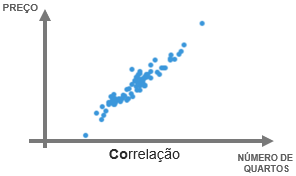

**2.Correlação negativa.**

Por outro lado, nós temos a correlação negativa, onde, quando uma variável aumenta, a outra diminui. Como por exemplo um imóvel que quanto maior a idade, menor o preço.

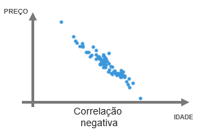

**3.Corelação nula**

Este caso é quando não existe nenhuma correlação entre os dados. 
Quando os dados estão assim, não é indicado utilizar o algoritmo de Regressão Linear, uma vez que uma reta teria grande margem de erro em relação aos pontos. 

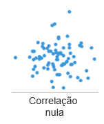

Vale lembrar que **correlação não é causalidade!**
Ou seja, não significa que o número de quartos seja a causa do preço ser maior ou menor. Significa apenas que matematicamente os dados se correlacionam. 

No site http://tylervigen.com/spurious-correlations temos diversos gráficos com correlações sem causalidade. Como por exemplo o gráfico que indica com 66.6% de correlação que quanto mais o ator Nicolas Cage aparece em filmes, mais pessoas morrem afogadas em uma piscina e vice-versa.

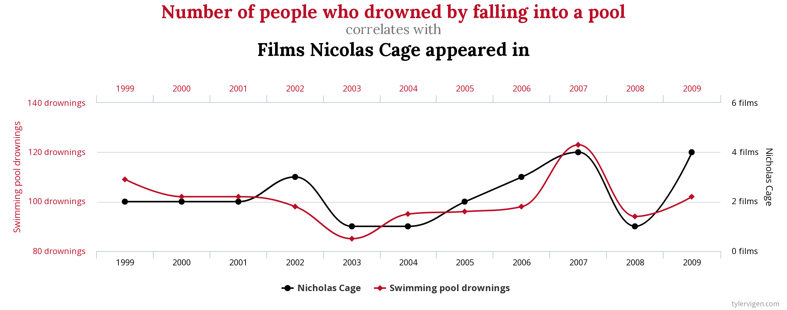

Você não irá precisar realizar os cálculos durante o dia a dia, mas para entender o funcionamento do seu modelo, é importante saber que o algoritmo de Regressão Linear utiliza a **equação da reta** para calcular e predizer o atributo alvo. 

Essa equação da reta é representada pela fórmula **y = b + a*x**. 

Para entender essa equação, imagine a situação onde você predizer o valor de um imóvel dado o número de quartos, ou seja:

* preço = valor_base_do_imóvel + valor_que_cada_quarto_agrega * número_quartos 

Portanto, se colocássemos em um gráfico:

1. **y** representa o preço do imóvel (atributo alvo). 

2. **b** representa a altura da reta (valor base do imóvel) 

.. only:: html

   .. image:: images/ML_Reg/b.gif

3. **a** representa a inclinação da reta (qual valor cada quarto agrega ao imóvel). 

.. only:: html

   .. image:: images/ML_Reg/a.gif

4. **x** representa o valor da variável (número de quartos).

03.b.II.Algoritmo Árvore de Decisão
++++

O algoritmo Árvore de Decisão possui esse nome por conta da anatomia que se parece com uma árvore de ponta cabeça.

Essa "árvore" é composta por Raiz e Nós que são justamente quando o algortimo entendeu um padrão e abriu um novo ramo (caminho). A predição do atributo alvo se encontram nas folhas.

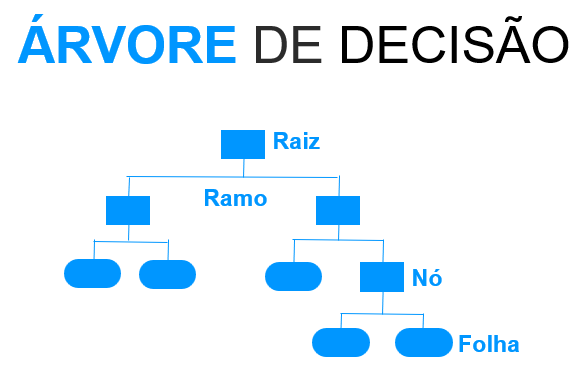

Podemos inserir os seguintes parâmetros em nossa árvore:

**1.** Número de amostras mínimas por divisão de nó.

**2.** Números de amostras mínimas por folha.

**3.** Profundidade máxima da árvore.

**4.** Número máximo de folhas.

**5.** Número máximo de atributos para fazer divisão.

O algoritmo Árvore de Decisão realiza seu passo a passo utilizando o conceito de **desvio padrão**. 

Desvio padrão é um conceito estatístico de variabilidade, que, ao possuir uma média, calculamos quanto os valores desviam do padrão. 

Imagine que existem dois vendedores de sorvetes na praia. Os dois vendem na média 100 picolés por dia. Porém o primeiro vendedor possui um desvio padrão de 24.5 picolés, ou seja, em algum dia ele pode vender 130 e em outro 70. Já o outro vendedor tem um desvio padrão de apenas 5 picolés, em um dia ele vende 105 e em outro 95. 

Com base nesse conceito, um desvio padrão menor é mais "confiável" na hora de realizar uma predição numérica.

Para calcular o desvio padrão nós temos que tirar a raiz da soma dos valores individuais menos a média dividido pelo número de valores.

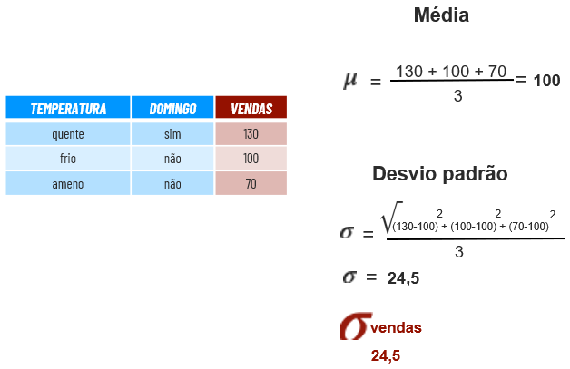

Dessa forma, durante a modelagem de dados o Algoritmo irá realizar os seguintes passo a passo:

**1.** Calcular o desvio padrão do atributo alvo.

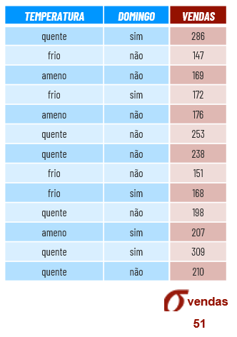

**2.** Calcular o desvio padrão de cada atributo preditor.

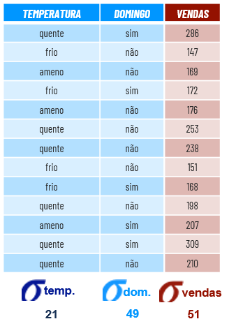

**3.** Calcular a redução do desvio padrão de cada atributo preditor.

Redução do desvio padrão é quando pegamos o desvio padrão do atributo alvo menor o desvio padrão do atributo preditor.

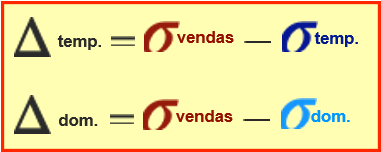

Aquele atributo preditor que tiver maior redução de desvio padrão significa que é um atributo preditor mais confiável pois desvia pouco da média, portanto ele será o atributo escolhido para ser a raiz da árvore.
Já o outro atributo preditor estará presente nos nós das árvores.

**4.** Criar a Árvore de Decisão.

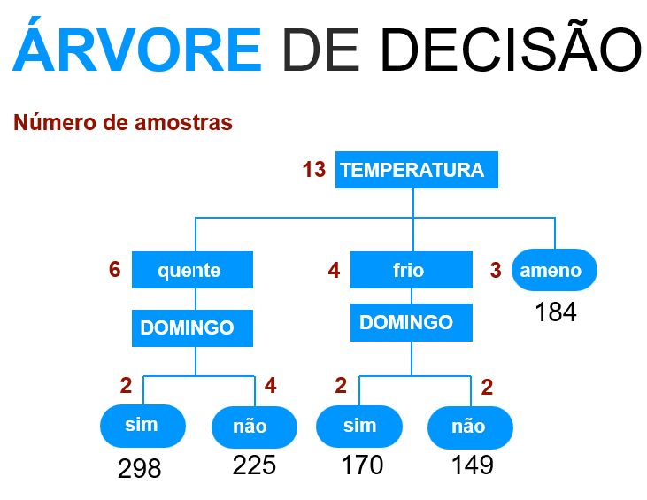
   
03.b.III.Algoritmo Floresta Aleatória
++++

O algoritmo Floresta Aleatória possui esse nome pois de forma aleatória ele seleciona várias amostras e cria diversas Árvores de Decisão.

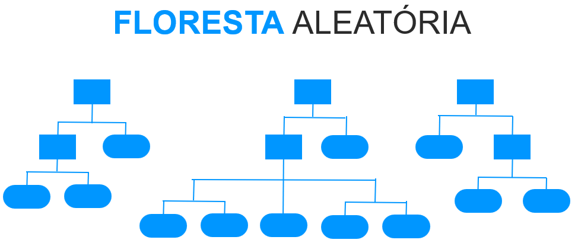

Esse algoritmo ajuda em relação ao overfitting, como ele seleciona os dados de treinamento (linhas e colunas) de forma aleatória para criar as árvores de decisões acaba impedindo uma superadequação aos dados. 

Matematicamente ele funciona da mesma forma que a Árvore de Decisão, porém com várias árvores ao invés de uma. 

O passo a passo realizado pelo algoritmo Floresta de Decisão é o seguinte:

**1.** Selecionar amostras (linhas) de forma aleatória

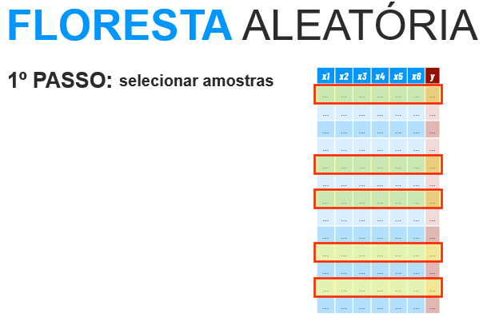

**2.** Criar a raiz da árvore.
  
  - Selecionar os atributos preditores de forma aleatória
  - Calcular a maior redução do desvio padrão

.. image:: images/ML_Reg/passo_dois.png
   :align: center
   :width: 450

**3.** Construir uma árvore de decisão.
  - Selecionar mais atributos de forma aleatória
  - Calcular maior redução do desvio padrão.
  - Selecionar **nós da árvore**
  - Fazer predições e guardar os resultados

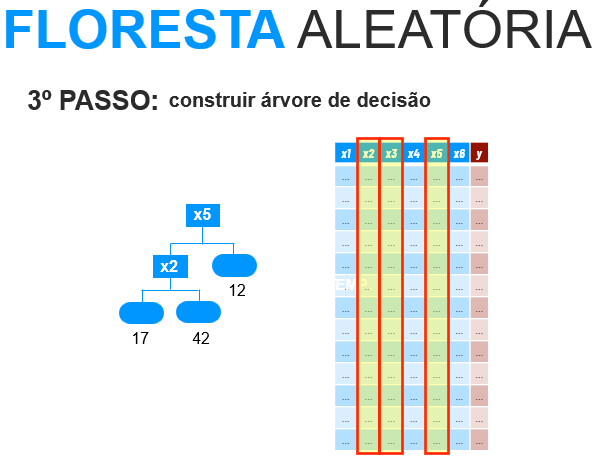

**4.** Construir mais árvores.
  - Repetir os passos 1, 2 e 3 até ter uma floresta

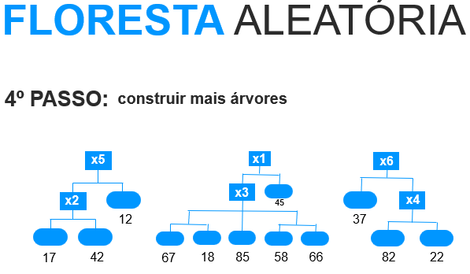

**5.** Utilizar a predição de cada Árvore de Decisão em nossa Floresta Aleatória para calcular uma média.

03.c.Avaliação de modelos de regressão
----

03.c.I.O que é erro
++++

Erro é sempre o número predito pelo modelo menos o número real.

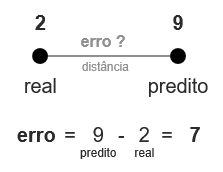

No caso de "erros negativos" usa-se o ferramental módulo, onde trabalha com o valor absoluto do número, ignorando o sinal, ou elevar ao quadrado e depois tirar a raiz. 

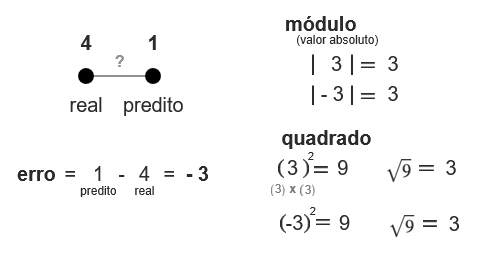
   
03.c.II.Como medir o erro
++++

Para medir um erro nós temos 3 formas:

**1.** Erro Médio Absoluto

No Erro Médio Absoluto nós iremos calcular o erro de cada linha e tirar a média, lembrando que a conta está em módulo, portanto não existirá erros negativos.

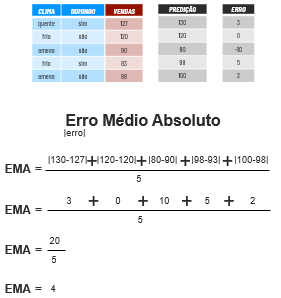

**2.** Erro Médio Quadrático

No Erro Médio Quadrático nós elevamos todos os erros ao quadrado e tiramos a média.

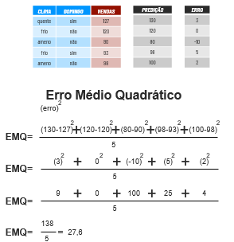

Como você pode ver, o Erro Médio Quadrático fica com um valor elevado quando possui erros de valores elevados. Para resolver isso temos o próximo método.

**3.** Raiz do Erro Médio Quadrático

A Raiz do Erro Médio Quadrático é a **Métrica de avaliação mais usada**. Para calcular nós tiramos a raiz do Erro Médio Quadrático.

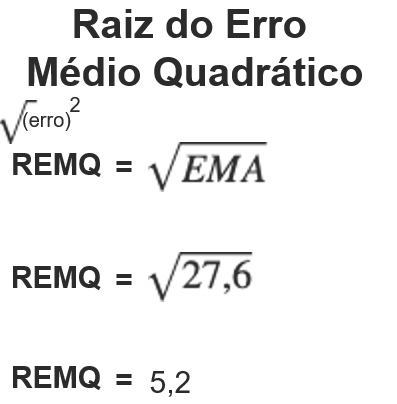
