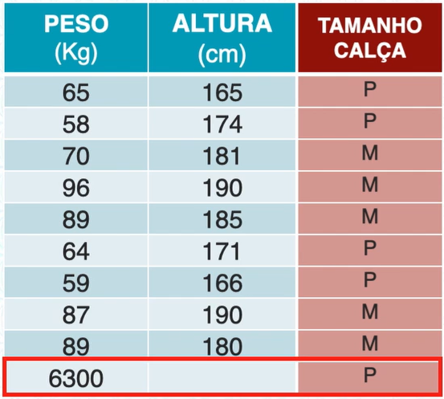
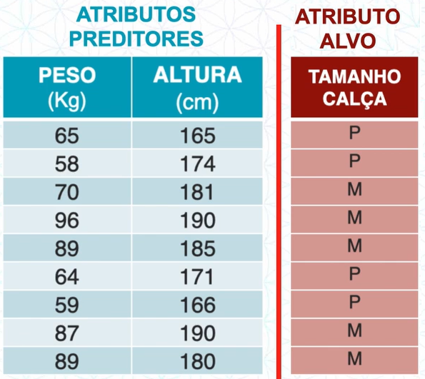
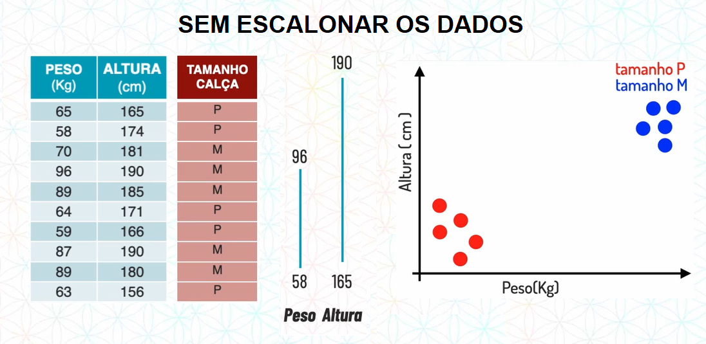
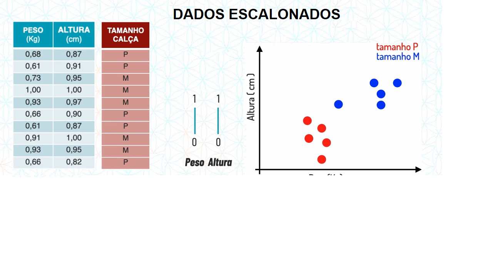
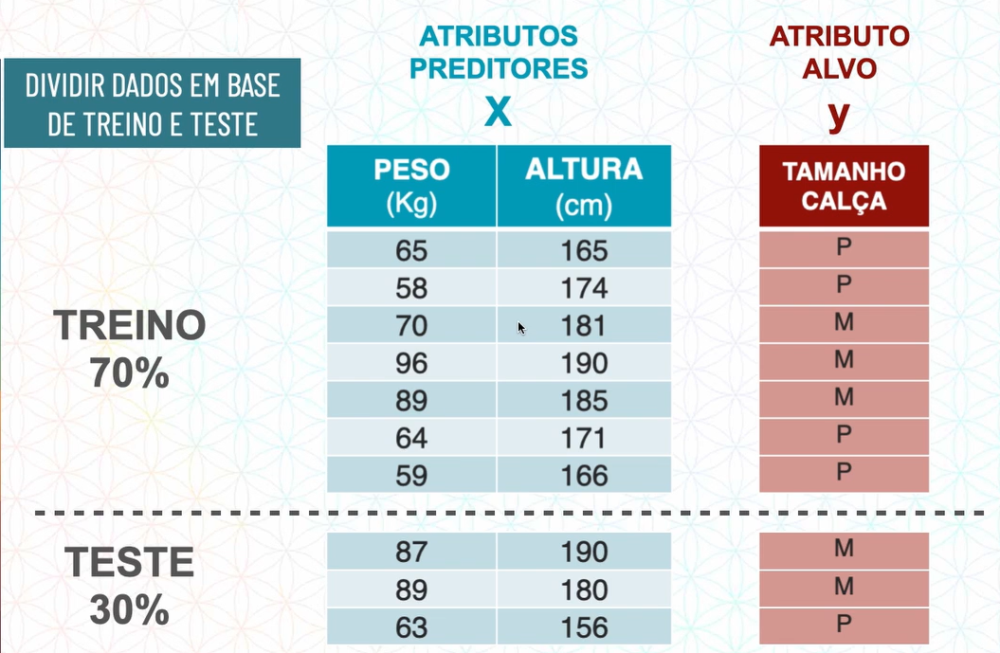
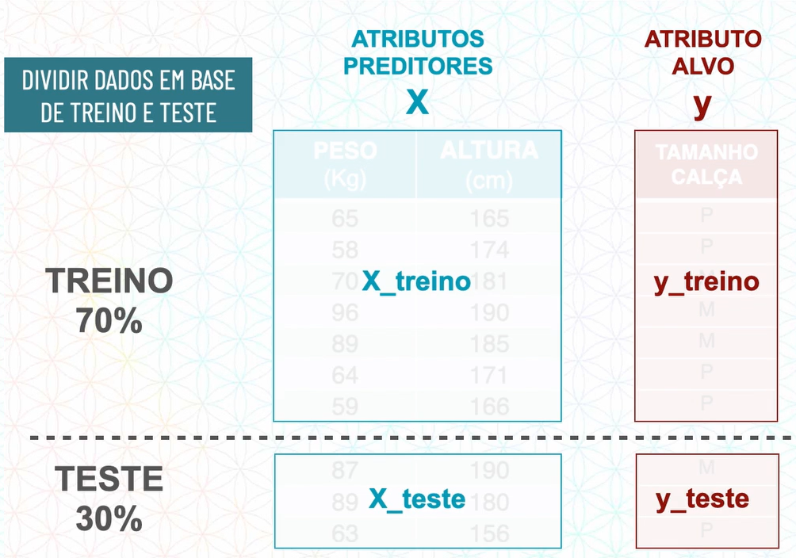
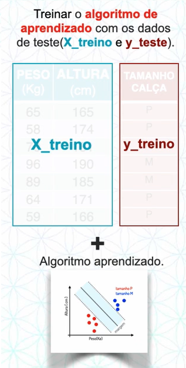
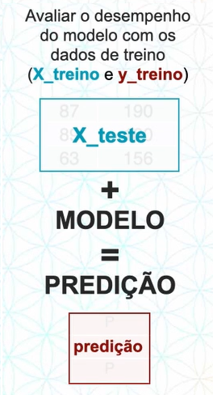
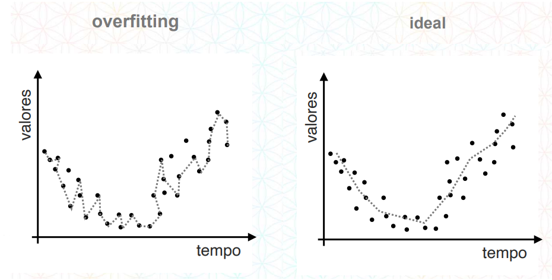
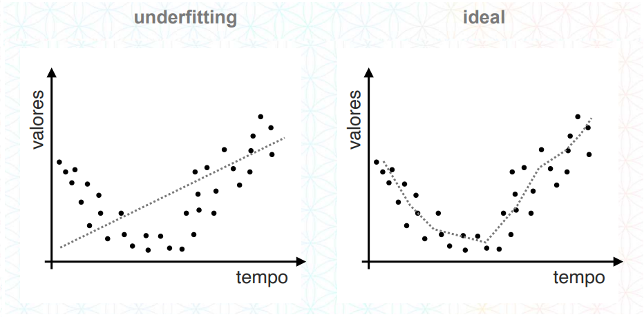

Treinamento de um modelo de ML
****

Antes de iniciarmos o treinamento do modelo de Machine Learning, vamos retormar rapidamente o roteiro de um projeto de ciência de dados:

   

Primeiro começamos na etapa de *Compreensão do negócio* onde definimos qual o problema de negócio que iremos atacar.

O segundo passo é a *Compreensão dos dados* onde entendemos quais são os dados necessários para resolver nosso problema de negócio e onde estão esse dados. 

O próximo passo é o de *Preparação dos dados* onde realizamos toda uma preparação para o nosso modelo de Machine Learning.

   
01.Preparação dos dados
=====

Este etapa do roteiro de um projeto de ciência de dados é uma das etapas mais fundamentais de todo o projeto.

É nessa etapa onde realizamos diversos procedimentos para tratar, limpar e adequar os dados, assim deixando o nosso modelo de Machine Learning mais preciso e acertivo possível. 

Nesta etapa lembre-se sempre da frase **Garbage in, garbage out**, ou seja, se inserirmos em nosso modelo de ML "lixo" (dados sujo) só teremos uma resposta "lixo" (errada).

01.a.Tratar os dados (valores)
-----

Muitas vezes podemos ter valores errados ou ausente, como no exemplo da tabela abaixo onde temos uma pessoa de 6300KG e sem altura registrada.

Obviamente este dados estão errados, isto nos leva a duas opções:

* **Apagar os dados**

Caso a base de dados seja muito grande e tenha poucos dados ausentes/errados, apagar os dados não terá grandes consequências, caso contrário não é uma opção muito recomendada, pois ao apagarmos estes dados, além dos dados sujos também apagamos dados valiosos para nosso projeto. 

* **Substituir os dados**
  
É sempre a opção mais recomendada pois não perdemos dados valiosos para nossos projetos, principalmente no caso de uma base de dados pequena. Podemos substituir os dados com valores da média, moda e mediana.

01.b.Separar em atributos preditores e atributo alvo
----

Nesta etapa da preparação dos dados nós separamos as colunas em:

* **Atributos preditores ou descritores**

São aqueles que nos ajudam a descrever o atributo alvo, é com esses atributos que o nosso modelo de ML irá aprender para chegar ao tributo alvo.

* **Atributo alvo**

É aquele atributo que com base nos atributos preditores o nosso modelo de ML irá encontrar, ou seja, é aquele atributo que queremos descobrir.

   
01.c.Escalonar os atributos preditores
----

Escalonar os atributos preditores ou descritores significa colocá-los em uma mesma escala, imagine o exemplo abaixo:

Repare que entre no atributo peso o menor valor é 58 e o maior 96, enquanto em altura, o menor valor já começa com 165 e o maior é 190. Essa distância pode ser um problema para algoritmos como o K-NN, que calcula a distância entre pontos.

Ao colocarmos em uma escala fica:

Repare como gráficamente a distância entre os pontos mudou. 
Dessa forma a classificação em algoritmos que trabalham com distância entre pontos, se torna mais precisa.

01.d.Dividir em base de treino e teste
----

Fizemos a primeira divisão que é separar em atributos preditores e atributo alvo, agora faremos uma segunda divisão que é separar em base de treino e base de teste.

Essa divisão entre base de treino e base de teste é realizada para que:

1. Durante o treinamento do modelo de ML será fornecido a base de treino com atributos preditores e atributos alvo. 

2. Na hora de avaliar o modelo, será fornecido a base de teste somente os atributos preditores para que o modelo de ML descubra os atributos alvo e possamos comparar as respostas.

Existem técnicas para saber qual porcentagem usamos na base de treino e na base de teste, porém o usual é ser 70% para treino e 30% para teste.

Por uma questão de nomenclatura chamamos as partes divididas da seguinte forma:

Onde:

* x_treino e x_teste está organizado em uma matriz. 

* y_treino e y_teste está organizado em um vetor.

02.Modelagem
====

Modelagem nada mais é que o treinamento de um modelo de ML, para realizar esta etapa nós adicionamos o algoritmo escolhido a nossa base de teste.

Dessa forma o algoritmo irá aprender com os atributos descritivos qual é o passo a passo para chegar no atributo alvo.

Depois que ele aprender com estes dados, irá se modelar, ou seja, virar um "molde" (modelo). 

Neste "molde" quando colocarmos novos atributos descritivos, sem o atributo alvo, ele irá realizar a predição do atributo alvo.

   
03.Avaliação do modelo
====

Após a modelagem do algoritmo, vamos avaliar o desempenho com os dados de treino.

A avaliação consiste em fornecer para o modelo a base de teste, sem o atributo alvo, ou seja, a X_teste, dessa forma ele ira gerar uma predição.

Agora compararamos a predição do modelo com os atributos alvo de teste (y_teste)

.. image:: images/ML/predicao_yteste2.png
   :align: center
   :width: 350

Neste exemplo ele acertou aproximadamente 66%, isto significa que ele tem uma acurácia de 66%. 

Neste momento olhamos para o nosso roteiro de um projeto de ciência de dados e verificamos se essa porcentagem de acertos faz sentido para o nosso problema de negócio, caso não faça voltamos ao começo, caso faça, damos sequência ao nosso projeto.

04.Overfitting e Underfitting
====

04.a.Overfitting
----

Overfitting é o termo usado para quando na hora da modelagem o algoritmo sofre um superadequamento aos dados. 

Imagine em uma situação onde o aluno não sabe nada da prova e o professor fornecesse todas as respostas corretas no dia anterior e o aluno decora essas respostas.
O aluno consequentemente gabarita a prova, porém isso não significa que ele aprendeu, se em um teste futuro o professor der outras perguntas, o aluno não irá saber responder.

A mesma coisa acontece com nosso modelo ao sofrer de overfitting, ele "decora" as respostas, porém ao tentar realizar novas predições, irá errar a grande maioria.

04.b.Underfitting
----

Underfitting é o termo utilizado para quando na hora da modelagem o algoritmo não conseguiu se adequar aos dados. Ou seja, não aprendeu nada, neste caso, consequentemente o modelo irá ter uma acurácia muito baixa e errar a grande maioria das predições.

