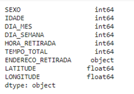
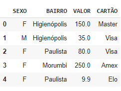
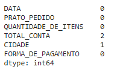

Compreensão dos Dados
*******

01.O que é Pandas
=========

01.a.Descrição sobre Pandas
------

•	Pandas é uma biblioteca em Python para trabalhar com dados, como por exemplo nas seguintes etapas do roteiro de um projeto de dados:
   
.. image:: images/pandas/projeto_de_dados.png
   :align: center
   :width: 450
 
Compreender os dados
+++++++++

•	Explorar
•	Analisar

Preparar os dados para algoritmos de aprendizagem
+++++++++

•	Limpar
•	Adequar

01.b.Importando o Pandas
-------

Para importarmos o Pandas para o Jupyter Notebook usamos o comando import. Como iremos escrever a palavra Pandas muitas vezes ao longo do código, é muito comum apelidarmos a biblioteca para um nome menor pd com o uso do comando as.
Como importar o Pandas para o Jupyter Notebook e apelidar de pd.

.. code-block:: python
   :linenos:
   
   import pandas as pd
   

02.Criando um DataFrame a partir de um dataset
------

Para criar um (objeto) DataFrame a partir de um dataset (conjunto de dados) precisamos seguir os seguintes passos:

Primeiro: colocar o dataset no projeto
++++++++++++

•	Ir em arquivos na aba lateral do Google Colaboratory.

.. image:: images/pandas/arquivos_colaboratory.png
   :align: center
   :width: 450

 
•	Arrastar o dataset para a parte de arquivos.

.. image:: images/pandas/arrastar_planilha.png
   :align: center
   :width: 450
 
•	Clicar com o botão direito em cima da planilha e depois em “copiar caminho” ou “copy path”.

.. image:: images/pandas/copiar_caminho.png
   :align: center
   :width: 450
 
•	Substituir o “endereço do arquivo” pelo caminho copiado.

.. image:: images/pandas/copiar_caminho_resultado.png
   :align: center
   :width: 550
 
Segundo: usar os métodos do Pandas para ler o arquivo
++++++++++++

•	``read_excel("endereço do arquivo")`` -> para ler arquivos do tipo planilha Excel.

•	``read_csv("endereço do arquivo")`` -> para ler arquivos do tipo csv.

•	Criar o objeto a partir do operador de atribuição -> ``=``

Exemplo:

.. code-block:: python
   :linenos:
   
   df = pd.read_excel(“endereço do arquivo”)
   
.. code-block:: python
   :linenos:

   print(df)
   
**Este é o resultado:**
   
.. image:: images/pandas/print_df.png
   :align: center
   :width: 450
 
03.Comandos básicos com o DataFrame
========

03.a.Visualizando o DataFrame
-----------

A forma mais comum de visualizar o DataFrame é usar o comando head() que nos mostra as primeiras linhas do DataFrame.
Por padrão, o método ``head()`` mostra as primeiras cinco linhas, mas caso desejamos mais, basta informar a quantidade dentro dos parênteses do método.
Exemplo:

.. code-block:: python
   :linenos:

   df.head()
   
**Este é o resultado:**
   
.. image:: images/pandas/df_head.png
   :align: center
   :width: 650
 
 
03.b.Formato do DataFrame
--------

Para entendermos o formato do DataFrame, ou seja, a quantidade de linhas e colunas, usamos a propriedade ``shape``.
Exemplo:

.. code-block:: python
   :linenos:

   df.shape
   
**Este é o resultado:**

.. code-block:: python
   
   >>> (23759, 9)

03.c.Tipos de Dados
-----------
A nomenclatura do tipo de dado do Pandas é diferente do tipo de dado do Python:

.. image:: images/pandas/nomenclatura_dados.png
   :align: center
   :width: 450
   
Para visualizarmos quais são os tipos de dados por coluna usamos a propriedade ``dtypes`` desta forma:

.. code-block:: python
   :linenos:

   df.dtypes
   
**Este é o resultado:**
   

   
   
04.Atributos
=======

Como vimos anteriormente, o DataFrame é organizado em linhas e colunas; as linhas para armazenar as entradas de dados e as colunas representam os atributos que descrevem as características dos dados de cada linha.

04.a.TIPOS DE ATRIBUTOS.
-------

Os atributos podem ser divididos da seguinte forma:
   
.. image:: images/pandas/tipos_atributos.png
   :align: center
   :width: 450
 
04.a.i.Numérico
++++++

•	Pode-se executar operações matemáticas, como subtração, soma, e aplicar conceitos estatísticos como média, moda, mediana.

**DISCRETO:**

•	``dtype: int64``
•	Número inteiro.
•	Geralmente resultado de uma contagem.
•	Exemplo: quantidade de pessoas, número de produtos em um estoque, etc.
•	Exemplo: quantidade de pessoas em uma sala: 18

**CONTÍNUO:**

•	``dtype: float64``
•	Número com casa decimal.
•	Geralmente é uma medida realizada com algum instrumento.
•	Exemplo: altura, peso, etc.
•	Exemplo: peso de um animal: 12,5 Kg.

04.a.ii. Categórico
+++++++

•	``dtype: string``
•	Pode-se apenas trabalhar com a medida estatística moda.
•	Representa uma classificação de categorias.

**ORDINAIS:**
•	Há ordenação.
•	Ex: escolaridade (primeiro, segundo, terceiro grau), estágio da doença (inicial, intermediária, avançada), etc.

**NOMINAIS:**
•	Não há ordenação.
•	Ex: sexo, cor do olho, aprovado/reprovado, etc.

05. Produzindo tabulações
=====

Tabular dados é uma forma de organizarmos os dados em linhas e colunas. Para isso costuma-se utilizar dois métodos para organizar os dados: ``unique() e value_counts()``.

05.a.Método ``unique( )``
-----

Mostra o domínio de uma coluna do DataFrame, ou seja, todas as categorias distintas que ele assume.
Exemplo:

•	Abaixo usamos o método ``df.SEXO.unique()`` para ver quais categorias diferentes ele assume:

.. code-block:: python
   :linenos:

   df.SEXO.unique()
   
**Este é o resultado:**

.. code-block:: python
   
   >>> array([1, 0])
 
 
05.b.Método ``value_counts()``
------

Gera uma tabela de frequências simples para um atributo (coluna) , ou seja, conta a quantidade de vezes que um valor aparece em um atributo (coluna).
Exemplo:

•	Abaixo usamos o método ``df.SEXO.value_counts()`` para ver quantas vezes ele assumiu as categorias 0 ou 1:

.. code-block:: python
   :linenos:

   df.SEXO.value_counts()
   
**Este é o resultado:**

.. code-block:: python
   
   >>> 1      17385
   >>> 0       6374

06. Agregações
======

Agregação é uma operação que agrega (junta) um grupo de dados para realizar contas com estatística para um grupo de linhas e colunas.
Por exemplo, suponha que você tenha o seguinte DataFrame:
   

 
Para você saber qual o valor total foi vendido por bairro, você precisa fazer uma agregação, para isso usamos o método ``groupby( )``, dessa forma:

.. code-block:: python
   :linenos:

   grupo_valor_bairro = df_vendas['VALOR'].groupby(df_vendas['BAIRRO'])
   
.. code-block:: python
   :linenos:

   print(grupo_valor_bairro.sum())
   

**Este é o resultado:**
   
.. image:: images/pandas/groupby.png
   :align: center
   :width: 350
 
Dessa forma os valores:

1.Na **coluna VALOR são agrupados** por valores da **coluna BAIRRO** 

2.Com o método ``sum()`` exibimos qual a somatória desses valores agregados.

07.Identificando os dados ausentes
====

É muito importante entender quantos dados ausentes há em cada coluna.

Para identificar quantos dados ausentes há em cada coluna usamos os métodos:

•	``isnull()`` para identificar dados ausentes.

•	``sum( )`` para somar todos os dados ausentes.

Vejo o exemplo de como usar os comandos ``df.isnull( ).sum( )``:

.. code-block:: python
   :linenos:

   df.isnull().sum()

**Este é o resultado:**

 
 
