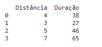
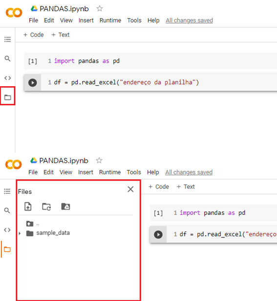
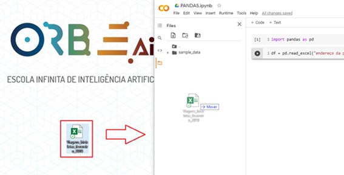
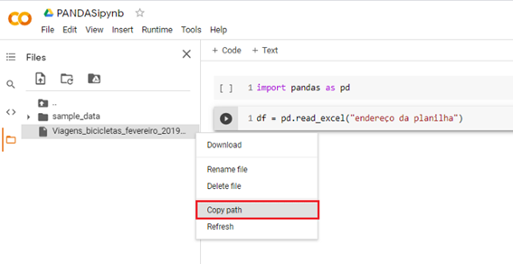
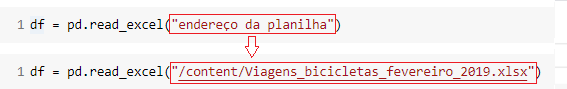
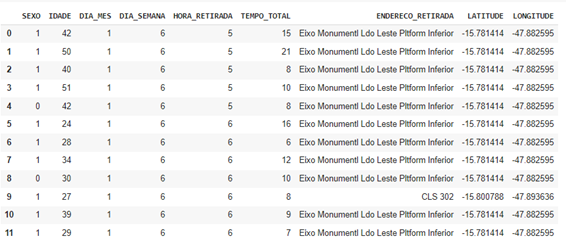

INTRODUÇÃO
*******

01.O QUE É PANDAS.
=========

01.a.DESCRIÇÃO SOBRE PANDAS.
------

•	Pandas é uma biblioteca em Python para trabalhar com dados, como por exemplo nas seguintes etapas do roteiro de um projeto de dados:

   
.. image:: AZUL/docs/images/pandas/projeto_de_dados.png
   :align: center
   :width: 400

 
COMPREENDER OS DADOS
+++++++++

•	Explorar
•	Analisar

PREPARAR OS DADOS PARA ALGORITMOS DE APRENDIZAGEM
+++++++++

•	Limpar
•	Adequar

01.b.IMPORTANDO O PANDAS.
-------

Para importarmos o Pandas para o Jupyter Notebook usamos o comando import. Como iremos escrever a palavra Pandas muitas vezes ao longo do código, é muito comum apelidarmos a biblioteca para um nome menor pd com o uso do comando as.
Como importar o Pandas para o Jupyter Notebook e apelidar de pd.

.. code-block:: python
   :linenos:
   
   import pandas as pd

02.DATAFRAME.
====

02.a.O QUE É UM DATAFRAME.
--------

•	É um objeto da biblioteca Pandas.
•	É uma estrutura de dados em forma de tabela composta por linhas e colunas.
•	Traduzindo para a português DataFrame seria um “Quadro de dados”.

02.b.ANATOMIA DE UM DATAFRAME
-------

.. figure::  anatomia_dataframe.png
   :align:   center

DATASET (conjunto de dados)
+++++++++

•	É o conjunto de dados que compõe o DataFrame.

LINHAS
+++++++++

•	São as linhas com os dados das respectivas colunas.
•	Também podem ser chamada de:
•	Entrada, instância e observação.

COLUNAS
+++++++++

•	São as colunas com os dados das características do dataset.
•	Também pode ser chamada de:
•	Variáveis ou atributos.

ÍNDICE
+++++++++

•	É uma espécie de coluna criada junto com o DataFrame para indicar a posição de cada linha. Repare que o índice começa a sua contagem a partir do 0 (zero) e não a partir do 1.
Observação: repare que em uma linha podemos ter diferentes tipos de dados, mas em uma coluna geralmente temos apenas um tipo de dado.

03.CRIANDO UM DATAFRAME.
=========

Basicamente há duas formas de se criar um DataFrame, uma a partir de poucos dados e outra com muitos dados.

03.a.CRIANDO UM DATAFRAME COM POUCOS DADOS.
-------

Para isso usamos o comando DataFrame( ) do Pandas, junto com os dados, para criar o objeto DataFrame. Como por exemplo usar uma estrutura de dados como o dicionário.

CRIAR O DICIONÁRIO.
++++++

.. code-block:: python
   :linenos:
   
   dados_da_corrida = {'Distância':[4,3,5,7],'Duração':[38,27,46,65]}

CRIAR O DATAFRAME.
++++++

.. code-block:: python
   :linenos:
   
   df_dic = pd.DataFrame(dados_da_corrida)

IMPRIMIR O DATAFRAME.
++++++

.. code-block:: python
   :linenos:

   print(df_dic)
   
**Este é o resultado:**
   

03.b.CRIANDO UM DATAFRAME A PARTIR DE UM DATASET.
------

Para criar um (objeto) DataFrame a partir de um dataset (conjunto de dados) precisamos seguir os seguintes passos:

PRIMEIRO: COLOCAR O DATASET NO PROJETO.
++++++++++++

•	Ir em arquivos na aba lateral do Google Colaboratory.

 
•	Arrastar o dataset para a parte de arquivos.

 
•	Clicar com o botão direito em cima da planilha e depois em “copiar caminho” ou “copy path”.

 
•	Substituir o “endereço do arquivo” pelo caminho copiado.

 
SEGUNDO: USAR OS MÉTODOS DO PANDAS PARA LER O ARQUIVO.
++++++++++++

•	``read_excel("endereço do arquivo")`` -> para ler arquivos do tipo planilha Excel.

•	``read_csv("endereço do arquivo")`` -> para ler arquivos do tipo csv.

•	Criar o objeto a partir do operador de atribuição -> ``=``

Exemplo:

.. code-block:: python
   :linenos:
   
   df = pd.read_excel(“endereço do arquivo”)
   
.. code-block:: python
   :linenos:

   print(df)
   
**Este é o resultado:**

.. figure::  print_df.png
   :align:   center
 
04.COMANDOS BÁSICOS COM O DATAFRAME.
========

04.a.VISUALIZANDO O DATAFRAME.
-----------

A forma mais comum de visualizar o DataFrame é usar o comando head() que nos mostra as primeiras linhas do DataFrame.
Por padrão, o método ``head()`` mostra as primeiras cinco linhas, mas caso desejamos mais, basta informar a quantidade dentro dos parênteses do método.
Exemplo:

.. code-block:: python
   :linenos:

   df.head()
   
**Este é o resultado:**

 
Para visualizarmos somente os dados de uma coluna específica do DataFrame basta indicar o nome da coluna como a seguir.

Exemplo:

Quando o nome da coluna possui espaços entre palavras.

.. code-block:: python
   :linenos:

   df[‘HORA RETIRADA’].head()

**Este é o resultado:**

+---+---+
| 0 | 5 |
+---+---+
| 1 | 5 |
+---+---+
| 2 | 5 |
+---+---+
| 3 | 5 |
+---+---+
| 4 | 5 |
+---+---+

Quando não há espaços entre as palavras do nome da coluna.

.. code-block:: python
   :linenos:

   df.HORA_RETIRADA.head()
   
**Este é o resultado:**   

+---+---+
| 0 | 5 |
+---+---+
| 1 | 5 |
+---+---+
| 2 | 5 |
+---+---+
| 3 | 5 |
+---+---+
| 4 | 5 |
+---+---+ 
 
04.b.FORMATO DO DATAFRAME.
--------

Para entendermos o formato do DataFrame, ou seja, a quantidade de linhas e colunas, usamos a propriedade ``shape``.
Exemplo:

.. code-block:: python
   :linenos:

   df.shape
   
**Este é o resultado:**

.. code-block:: python
   
   >>> (23759, 9)
