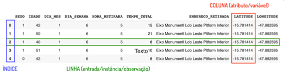
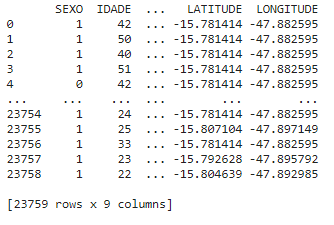

Introdução
*******

01.O que é Pandas
=========

01.a.Descrição sobre Pandas
------

•	Pandas é uma biblioteca em Python para trabalhar com dados, como por exemplo nas seguintes etapas do roteiro de um projeto de dados:

.. image:: images/pandas/projeto_de_dados.png
   :align: center
   :width: 450

 
Compreender os dados
+++++++++

•	Explorar
•	Analisar

Preparar os dados para algoritmos de aprendizagem
+++++++++

•	Limpar
•	Adequar

01.b.Importando o Pandas
-------

Para importarmos o Pandas para o Jupyter Notebook usamos o comando import. Como iremos escrever a palavra Pandas muitas vezes ao longo do código, é muito comum apelidarmos a biblioteca para um nome menor pd com o uso do comando as.
Como importar o Pandas para o Jupyter Notebook e apelidar de pd.

.. code-block:: python
   :linenos:
   
   import pandas as pd

02.DataFrame
====

02.a.O que é um DataFrame
--------

•	É um objeto da biblioteca Pandas.
•	É uma estrutura de dados em forma de tabela composta por linhas e colunas.
•	Traduzindo para a português DataFrame seria um “Quadro de dados”.

02.b.Anatomia de um DataFrame
-------

DATASET (conjunto de dados)
+++++++++

•	É o conjunto de dados que compõe o DataFrame.

Linhas
+++++++++

•	São as linhas com os dados das respectivas colunas.
•	Também podem ser chamada de:
•	Entrada, instância e observação.

Colunas
+++++++++

•	São as colunas com os dados das características do dataset.
•	Também pode ser chamada de:
•	Variáveis ou atributos.

Índice
+++++++++

•	É uma espécie de coluna criada junto com o DataFrame para indicar a posição de cada linha. Repare que o índice começa a sua contagem a partir do 0 (zero) e não a partir do 1.
Observação: repare que em uma linha podemos ter diferentes tipos de dados, mas em uma coluna geralmente temos apenas um tipo de dado.

03.Criando um DataFrame
=========

Basicamente há duas formas de se criar um DataFrame, uma a partir de poucos dados e outra com muitos dados.

03.a.Criando um DataFrame com poucos dados
-------

Para isso usamos o comando DataFrame( ) do Pandas, junto com os dados, para criar o objeto DataFrame. Como por exemplo usar uma estrutura de dados como o dicionário.

Criar o dicionário
++++++

.. code-block:: python
   :linenos:
   
   dados_da_corrida = {'Distância':[4,3,5,7],'Duração':[38,27,46,65]}

Criar o DataFrame
++++++

.. code-block:: python
   :linenos:
   
   df_dic = pd.DataFrame(dados_da_corrida)

Imprimir o DataFrame
++++++

.. code-block:: python
   :linenos:

   print(df_dic)
   
**Este é o resultado:**

.. image:: images/pandas/df_dic.png
   :align: center
   :width: 450

03.b.Criando um DataFrame a partir de um dataset
------

Para criar um (objeto) DataFrame a partir de um dataset (conjunto de dados) precisamos seguir os seguintes passos:

Primeiro: colocar o dataset no projeto
++++++++++++

•	Ir em arquivos na aba lateral do Google Colaboratory.

.. image:: images/pandas/arquivos_colaboratory.png
   :align: center
   :width: 450
 
•	Arrastar o dataset para a parte de arquivos.

.. image:: images/pandas/arrastar_planilha.png
   :align: center
   :width: 450
 
•	Clicar com o botão direito em cima da planilha e depois em “copiar caminho” ou “copy path”.

.. image:: images/pandas/copiar_caminho.png
   :align: center
   :width: 450
 
•	Substituir o “endereço do arquivo” pelo caminho copiado.
   
.. image:: images/pandas/copiar_caminho_resultado.png
   :align: center
   :width: 450
 
Segundo: usar os métodos do Pandas para ler o arquivo
++++++++++++

•	``read_excel("endereço do arquivo")`` -> para ler arquivos do tipo planilha Excel.

•	``read_csv("endereço do arquivo")`` -> para ler arquivos do tipo csv.

•	Criar o objeto a partir do operador de atribuição -> ``=``

Exemplo:

.. code-block:: python
   :linenos:
   
   df = pd.read_excel(“endereço do arquivo”)
   
.. code-block:: python
   :linenos:

   print(df)
   
**Este é o resultado:**

 
04.Comandos básicos com DataFrame
========

04.a.Visualizando o DataFrame
-----------

A forma mais comum de visualizar o DataFrame é usar o comando head() que nos mostra as primeiras linhas do DataFrame.
Por padrão, o método ``head()`` mostra as primeiras cinco linhas, mas caso desejamos mais, basta informar a quantidade dentro dos parênteses do método.
Exemplo:

.. code-block:: python
   :linenos:

   df.head()
   
**Este é o resultado:**
   
.. image:: images/pandas/df_head.png
   :align: center
   :width: 600
 
Para visualizarmos somente os dados de uma coluna específica do DataFrame basta indicar o nome da coluna como a seguir.

Exemplo:

Quando o nome da coluna possui espaços entre palavras.

.. code-block:: python
   :linenos:

   df[‘HORA RETIRADA’].head()

**Este é o resultado:**

+---+---+
| 0 | 5 |
+---+---+
| 1 | 5 |
+---+---+
| 2 | 5 |
+---+---+
| 3 | 5 |
+---+---+
| 4 | 5 |
+---+---+

Quando não há espaços entre as palavras do nome da coluna.

.. code-block:: python
   :linenos:

   df.HORA_RETIRADA.head()
   
**Este é o resultado:**   

+---+---+
| 0 | 5 |
+---+---+
| 1 | 5 |
+---+---+
| 2 | 5 |
+---+---+
| 3 | 5 |
+---+---+
| 4 | 5 |
+---+---+ 
 
04.b.Formato do DataFrame
--------

Para entendermos o formato do DataFrame, ou seja, a quantidade de linhas e colunas, usamos a propriedade ``shape``.
Exemplo:

.. code-block:: python
   :linenos:

   df.shape
   
**Este é o resultado:**

.. code-block:: python
   
   >>> (23759, 9)
