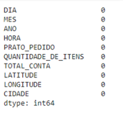
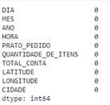
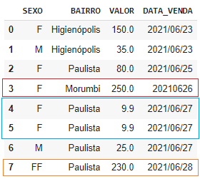
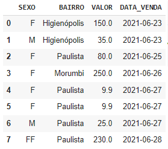
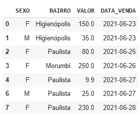

Tratamento dos dados
********

Limpar os dados significa arrumar dados ruins do dataset.

Os casos mais comuns são:
•	Dados ausentes.
•	Dados em formatação errada.
•	Dados errados.
•	Dados duplicados.

01.a.Importando o Pandas
===========

Para importar a bibiloteca Pandas usamos o comando ``import`` e logo em seguida usamos o comando ``as`` para apelidá-la de pd.

.. code-block:: python
   :linenos:
   
   import pandas as pd

 
01.b.Criando o DataFrame
========

Usaremos um dataset sobre pedidos de delivery de um restaurante fictício.
Para criar o DataFrame:

.. code-block:: python
   :linenos:
   
   df = pd.read_excel(“endereço do arquivo”)

 
Visualizando o DataFrame com o método head().

.. code-block:: python
   :linenos:

   df.head()
   
**Este é o resultado:**

.. image:: images/pandas/head_nan.png
   :align: center
   :width: 550

.. warning:: 
  Repare que os dados ausentes são representados pela sigla ``NaN`` no DataFrame.
  
  
Entendendo o formato do DataFrame com a propriedade shape:

.. code-block:: python
   :linenos:

   df.shape
   
**Este é o resultado:**

.. code-block:: python
   
   >>> (2134, 10)

 
02.Identificando os dados ausentes
=======

Antes de tratar os dados ausentes vamos entender quantos dados ausentes há em cada coluna.
Para isso usamos os métodos:

•	``isnull()`` para identificar dados ausentes.
•	``sum()`` para somar todos os dados ausentes.

Vejo o exemplo de como usar os comandos ``df.isnull( ).sum( )``:

.. code-block:: python
   :linenos:

   df.isnull().sum()

**Este é o resultado:**

.. image:: images/pandas/isnull_sum_delivery.png
   :align: center
   :width: 450
 
03.Limpando os dados ausentes
========

03.a.Remover linhas com dados ausentes
---------

Uma das formas que temos para trabalhar com dados ausentes é remover toda a linha em que ele está. 

.. warning::

  Isto é usado em útimos casos, já que nos faz perder os demais dados de linha que contém o dado ausente.

Por motivos de segurança, iremos primeiro realizar uma cópia do DataFrame e em seguida remover as linhas desta cópia com o comando ``dropna()``.

.. code-block:: python
   :linenos:
   
   #Criando uma cópia do DataFrame
   novo_df = df.copy()

.. code-block:: python
   :linenos:

   #Removendo as linhas com dados ausentes da cópia do DataFrame e informar que a alteração será no novo_df.
   novo_df.dropna(inplace=True)

.. code-block:: python
   :linenos:
   
   #Verificando a quantidade de linhas após a remoção das linhas com dados ausentes com o comando shape.
   novo_df.shape
   
**Este é o resultado:**

.. code-block:: python
   :linenos:
   
   >>> (2133, 10)

.. code-block:: python
   :linenos:
   
   #Verificando a quantidade de dados ausentes com o comando isnull().sum().
   novo_df.isnull().sum()

**Este é o resultado:**

 
03.b.Substituir os dados ausentes
--------

**Não temos que deletar toda uma linha e perder dados:**

•	O método ``fillna()`` preenche os dados vazios com um valor.

.. code-block:: python
   :linenos:

   df.fillna(valor)
   
   
.. note::
  
   Se visualizarmos o DataFrame com o método ``head()`` perceberemos que a alterção não foi realizada e salva no DataFrame.

Para realizar e salvar a alteração devemos usar ``inplace=True`` com o método ``fillna()``

.. code-block:: python
   :linenos:

   df.fillna(valor, inplace=True)

 
03.b.I.Valores mais comuns para substituir os dados ausentes
+++++++++++++

.. image:: images/pandas/head_nan.png
   :align: center
   :width: 550

É muito comum usarmos os valores: **média, moda e mediana** para substituir os valores ausentes.

Veja um exemplo com média na coluna ``TOTAL``.
+++++++

.. code-block:: python
   :linenos:
   
   #Descobrindo o valor da média e salvando-a de dentro de uma variável.
   media_TOTAL_CONTA = df.TOTAL_CONTA.mean( )

.. code-block:: python
   :linenos:
   
   #Subistituindo os valores ausentes com a média.
   df.TOTAL_CONTA.fillna(media_TOTAL_CONTA, inplace=True)

.. code-block:: python
   :linenos:   

   #Verificando a alteração.
   df.head(6)

**Este é o resultado:**

.. image:: images/pandas/head_total_conta.png
   :align: center
   :width: 550

.. code-block:: python
   :linenos:   

   #Verificando a alteração com o comando isnull().sum().   
   df.isnull().sum()
   
**Este é o resultado:**

.. image:: images/pandas/isnull_sum_total_conta.png
   :align: center
   :width: 450

Veja um exemplo da moda na coluna ``CIDADE``
+++++++

.. note::
   
   Caso opte pela moda, repare que para salvar o valor de moda em uma variável temos que adiconar [0] ao final.
   
.. code-block:: python
   :linenos: 
   
   #Descobrindo o valor da moda e salvando em uma variável.
   moda_CIDADE = df.CIDADE.mode()[0]

.. code-block:: python
   :linenos: 
   
   #Substituindo os valores ausentes pela moda.
   df.CIDADE.fillna(moda_CIDADE, inplace = True)

.. code-block:: python
   :linenos:   

   #Verificando a alteração.
   df.head(6)

**Este é o resultado:**

.. image:: images/pandas/head_cidade.png
   :align: center
   :width: 450

.. code-block:: python
   :linenos:   

   #Verificando a alteração com o comando isnull().sum().   
   df.isnull().sum()
   
**Este é o resultado:**

 
04.Dados em formatação errada
========

Considere o seguinte DataFrame:

 
Repare que temos alguns erros comuns presentes no DataFrame:

•	A ``linha 3`` está com 20210626 ao invés de 2021/06/26.

•	A ``linha 5`` está duplicada.

•	A ``linha 7`` está com FF ao invés de F.

04.b.Data com formato errado
--------------

Para corrigir o dado da linha 3 para o formato correto vamos converter toda a coluna para o formato data — **Ano/Mês/Dia** — 0000/00/00.

Para isso o pandas tem o método:

.. code-block:: python
   :linenos: 
   
   to_datetime()
   
Para usá-lo vamos acessar a coluna ``DATA_VENDA`` e então usamos o método ``to_datetime()`` apenas na coluna desejada.

.. code-block:: python
   :linenos:   

   df.DATA_VENDA = pd.to_datetime(df.DATA_VENDA)
   
**Este é o resultado:**

.. note::
  
  A data do DataFrame precisa ser uma string e estar no formato americano por isso Ano/Mês/Dia para o método ``to_datetime()`` funcionar.

 
04.c.Linhas duplicadas
---------------

Para descobrir quais linhas estão duplicadas em um DataFrame usamos o método:

.. code-block:: python
   :linenos: 

   duplicated()

Ele irá gerar um dado tipo ``booleano`` para cada linha, mostrando:

•	``True`` para as linhas duplicadas.
•	``False`` para as linhas não duplicadas.

.. image:: images/pandas/df_formatacao_duplicated.png
   :align: center
   :width: 450

Para corrigirmos a linha 5 que está duplicada vamos exclui-lá.
Para isso usamos o método:

.. code-block:: python
   :linenos:
   
   drop_duplicates(inplace = True)
   
Nesse método pedimos ao pandas excluir todas as linhas que deram o resultado ``True ``no comando no método ``df.duplicated()``

**Este é o resultado:**

.. image:: images/pandas/df_formatacao_duplicated_resultado.png
   :align: center
   :width: 450

4.d.Dado com formato errado
---------------

Para corrigirmos o dado da linha 7 vamos substituir o valor ``FF`` por ``F``. 

Para isso vamos usar o método:

.. code-block:: python
   :linenos:
   
   loc[linha, coluna] = valor_desejado
   
Com o método loc vamos colocar os parâmetros linha e coluna e escrever qual o ``valor_desejado`` que queremos substituir. 

Exemplo:

.. code-block:: python
   :linenos:
   
   #Usando o método loc para substituir o valor FF pelo F
   df.loc[7, 'SEXO'] = 'F'
   
.. code-block:: python
   :linenos:
   
   #Usando o comando head para mostrar o DataFrame
   df.head()

**Este é o resultado:**

   

