Conectando GitHub e Streamlit
****

Através da união de ferramentas como GitHub e Streamlit é possível criar um aplicativo que fique na nuvem, sem que precise gerar um link toda vez, de forma muito simples e prática.

01.Criando uma conta no Streamlit
====

Para criar uma conta no Streamlit basta seguir o paasso a passo: 

01.Clicar neste link: https://share.streamlit.io/signup

02.Clicar em "Continue with GitHub" 

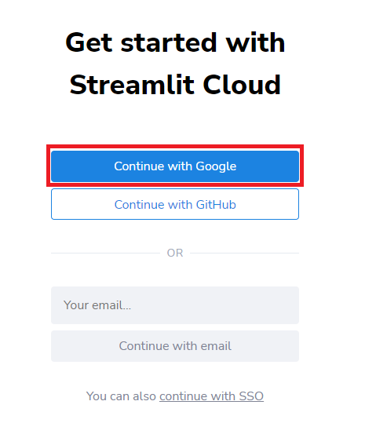

03.Clicar em Authrorize Streamlit

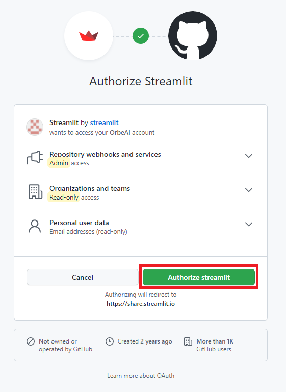

04.Escolha o plano **Community**

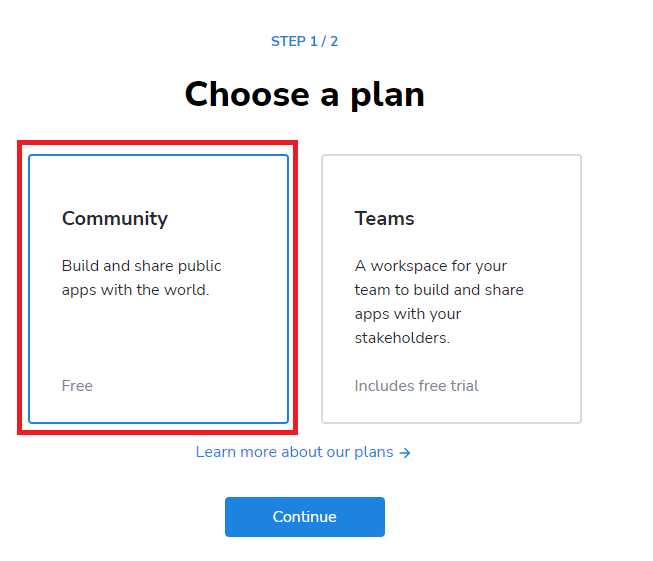

05.Insira seus dados pessoais e clique em **Continue**

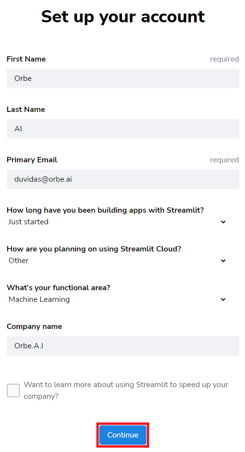

06.Pronto! Você já pode lançar seus aplicativos agora

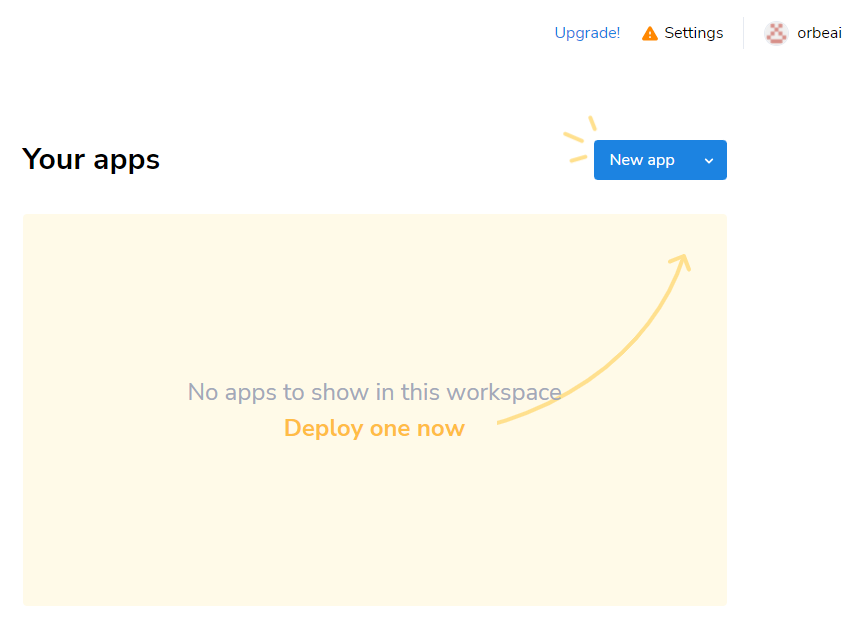
   

02.Criando um aplicativo de classificação com Streamlit no GitHub
====

02.a.Criando o repositório no GitHub
----

Antes de fazermos o deploy (subir para nuvem) do aplicativo vamos primeiro criá-lo no GitHub. 

Para isso siga o passo a passo abaixo:

1.Entre na sua conta do GitHub e vá em **Repositories** e clique em **New**

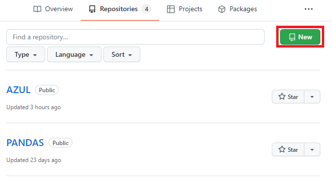

2.Coloque o nome desejado do repositório e deixe selecionado como **Public** (caso contrário não é possível realizar o deploy), adicione um **README file** se desejado e clique em **Create repository**

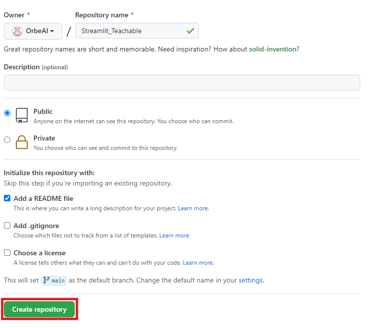

Pronto, seu repositório está criado.

02.b.Criando o arquivo requirements.txt
----

Este arquivo chamado **requirements.txt** é o arquivo onde vamos colocar todas as bibliotecas que iremos utilizar em nosso código

Que em nosso caso são:

.. code-block:: python 
    :linenos:

    numpy
    pillow
    tensorflow
    keras
    streamlit

Para isso dentro de seu repositório clique em **Add file** e depois em **Create new file**

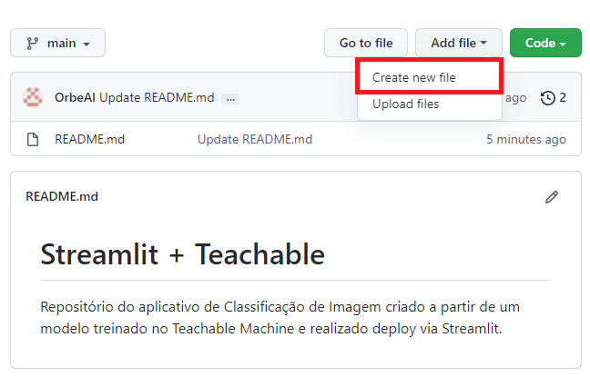

Insira o nome **requirements.txt** , coloque as bibliotecas desejadas e depois clique em **Commit new file**

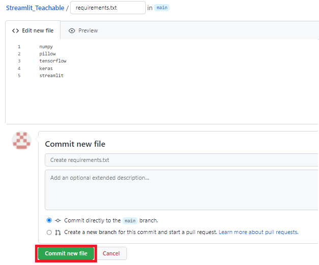

Pronto, seu arquivo requimerents.txt já está criado com todas as bibliotecas necessárias.

02.c.Fazendo upload do modelo de classificação de imagem
-----

Em nosso exemplo estamos desenvolvendo um aplicativo de classificação de imagem, para isso iremos usar o **keras_model.h5** e o **labels** treinado no Teachable Machine

Para realizar o upload desses arquivos vá em seu repositório do streamlit, clique me **Add file** e depois em **Upload files**

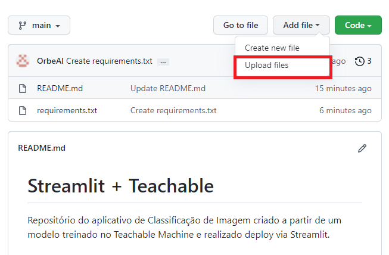

Selecione o arquivo **keras_model.h5** e o **labels** e arraste para a área de **Drag files here to add them to your repository**

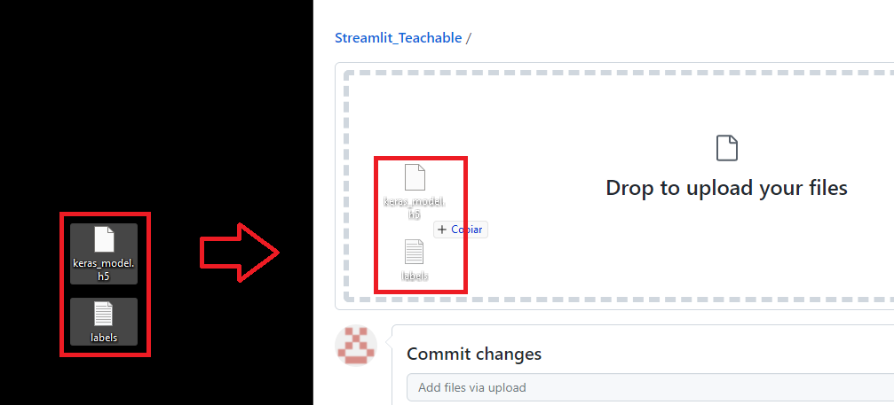

Espere o upload dos arquivos e depois selecione **Commit changes**

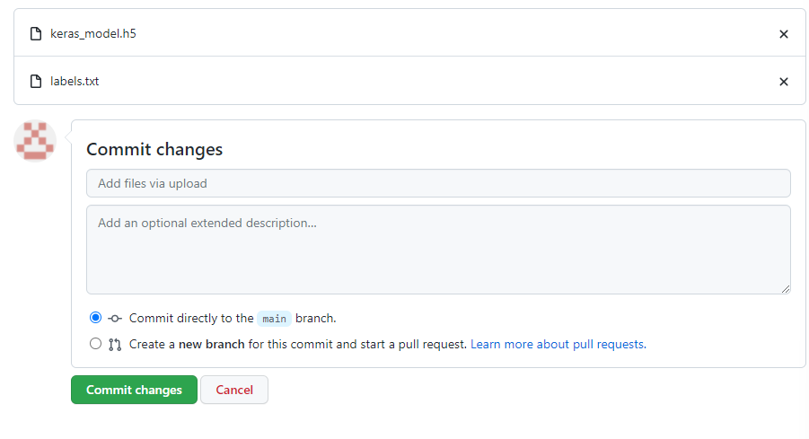

Pronto, agora já temos em nosso repositório o modelo treinado.

02.d.Criar o arquivo para classificar imagens
----

Para criarmos o arquivo classificador de imagens clique em **Add file** e depois em **Create new file**

Insira o nome **arquivo_classificador_de_imagem.py** e coloque o código abaixo:

.. code-block:: python 
    :linenos:

    import tensorflow
    from keras.models import load_model
    from PIL import Image, ImageOps
    import numpy as np

    def funcao_classificar_imagem(img, keras_model):

      # Disable scientific notation for clarity
      np.set_printoptions(suppress=True)

      # Load the model
      model = load_model('keras_model.h5')

      # Create the array of the right shape to feed into the keras model
      # The 'length' or number of images you can put into the array is
      # determined by the first position in the shape tuple, in this case 1.
      data = np.ndarray(shape=(1, 224, 224, 3), dtype=np.float32)

      # Replace this with the path to your image
      image = img

      #resize the image to a 224x224 with the same strategy as in TM2:
      #resizing the image to be at least 224x224 and then cropping from the center
      size = (224, 224)
      image = ImageOps.fit(image, size, Image.ANTIALIAS)

      #turn the image into a numpy array
      image_array = np.asarray(image)

      # display the resized image
      image.show()

      # Normalize the image
      normalized_image_array = (image_array.astype(np.float32) / 127.0) - 1

      # Load the image into the array
      data[0] = normalized_image_array

      # run the inference
      prediction = model.predict(data)
      print(prediction)

      return np.argmax(prediction)

Depois de inserir o código no arquivo clique **Commit new file**

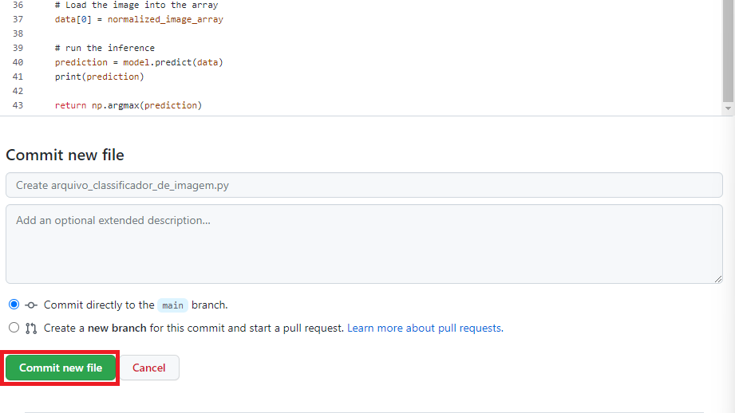

Pronto, com isso já temos o arquivo necessário para classificar nossas imagens.

02.e.Criar o arquivo para o aplicativo
----

Este é o arquivo que de fato o Streamlit irá ler e rodar as funções, será o nosso *front-end* responsável pela aparência e ferramentas disponíveis para o usuário final. 

Até agora estávamos preparando o *back-end* responsável por dar toda a estrura que precisávamos para rodar nosso aplicativo. 

Para criarmos o arquivo para o aplicativo clique em **Add file** e depois em **Create new file**

Insira o nome **arquivo_aplicativo_de_classificacao.py** e coloque o código abaixo:

.. code-block:: python 
    :linenos:

    from arquivo_classificador_de_imagem import funcao_classificar_imagem
    import streamlit as st
    from PIL import Image

    # Criar os elementos que compõe o aplicativo.
    # TÍTULO DO SITE.
    st.title("Classificador de milho.")

    # BOTÃO PARA FAZER UPLOAD DA IMAGEM A SER CLASSIFICADA.
    uploaded_file = st.file_uploader("Escolha um arquivo", type="jpg")

    # CLASSIFICAÇÃO DA IMAGEM.
    if uploaded_file is not None:

        # ABRIR A IMAGEM CARREGADA.
        image = Image.open(uploaded_file)

        # MOSTRAR A IMAGEM.
        st.image(image, caption='', use_column_width=True)

        # TEXTO INDICANDO QUE A IMAGEM ESTÁ SENDO CLASSIFICADA.
        st.write("Classificando...")

        # CHAMAR A FUNÇÃO DE CLASSIFICAÇÃO DE IMAGEM
        # E ARMAZENAR O RESULTADO NA VARIÁVEL LABEL.
        label = funcao_classificar_imagem(image, 'keras_model.h5')

        # CONDICIONAL PARA IDENTIFICAR A CLASSE DA IMAGEM.
        if label == 1:

            # INSIRA O NOME DA PRIMEIRA CLASSE.
            st.write("Milho bom.")

        else:

          # INSIRA O NOME DA SEGUNDA CLASSE.
            st.write("Milho ruim.")

.. warning::

    Não esqueça de realizar as alterações necessárias como o título do aplicativo, nome das classes, etc.

Depois de inserir o código no arquivo e realizar as alterações desejadas clique **Commit new file**

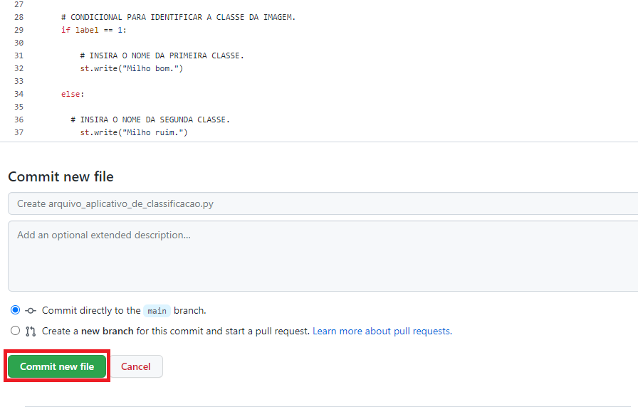

Pronto, com isso já temos o arquivo necessário para rodar o aplicativo.

03.Fazendo deploy do app no Streamlit
====

Agora que já temos todo nosso repositório criado no GitHub iremos fazer o deploy do aplicativo via Streamlit. 

Para isso:

01.Vá em sua conta do Streamlit clique em **New app**

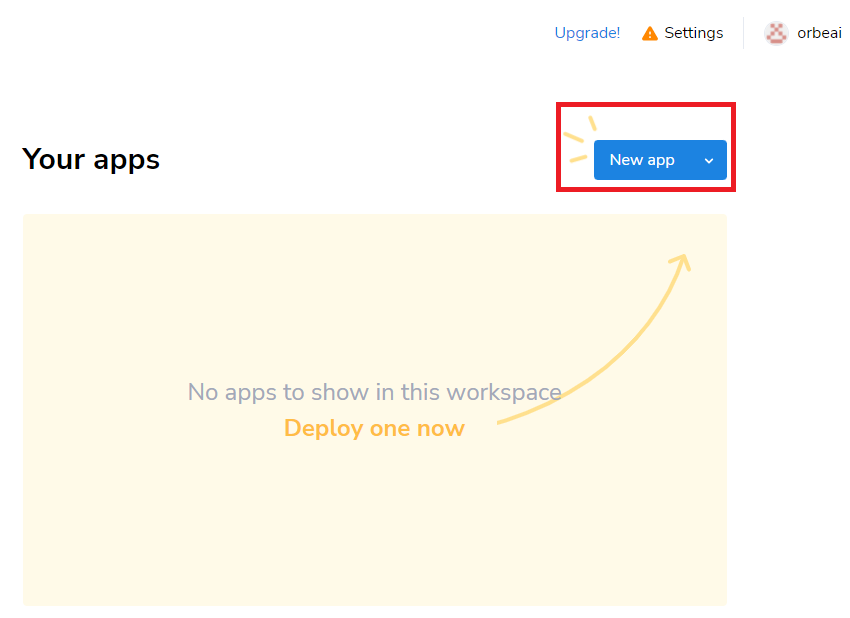

02.Clique me **Authorize streamlit**

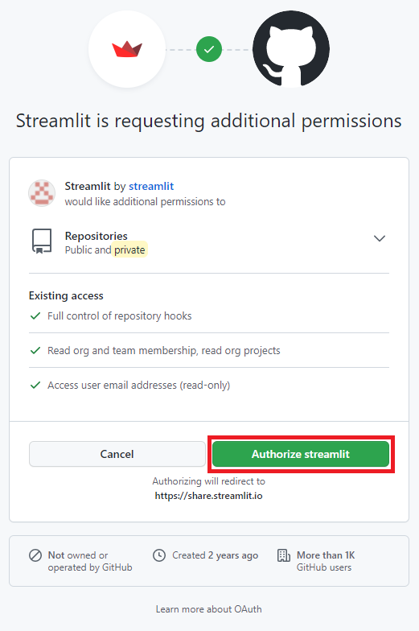

03.Na parte de **Repository** selecione o repositório do seu aplicativo

.. image:: images/streamlit/repository.png
   :align: center
   :width: 450

04.Em **Branch** selecione qual versão deseja, em nosso caso **main**

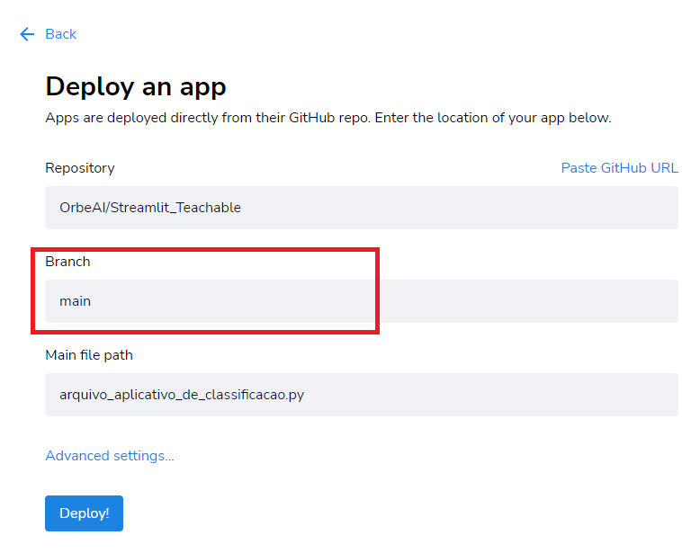

05.Em **Main file path** selecione onde está o arquivo que o streamlit irá ler, o nosso *front-end*, em nosso caso é o **arquivo_aplicativo_de_classificacao.py**

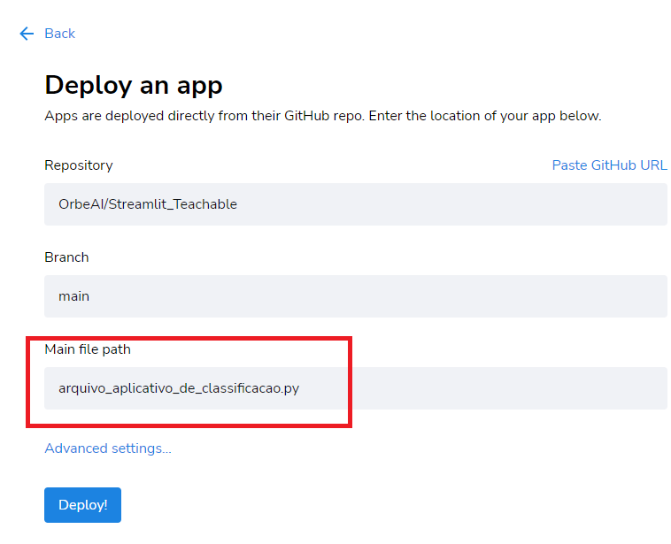

06.Clique em **Deploy!**

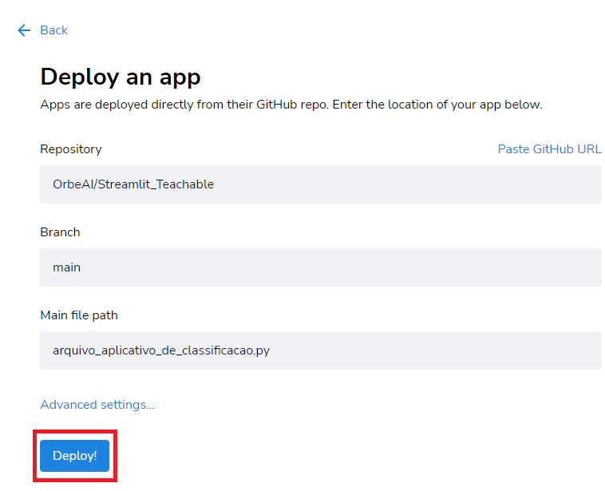

07.Espere enquanto seu aplicativo "está no forno" (pode levar alguns minutos) 

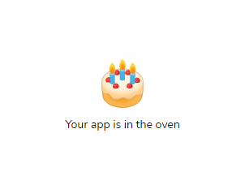

Pronto!! Seu aplicativo já está pronto e inclusive **este link é compartilhavel e não cai, funciona 24/7!** 

https://share.streamlit.io/orbeai/streamlit_teachable/main/arquivo_aplicativo_de_classificacao.py

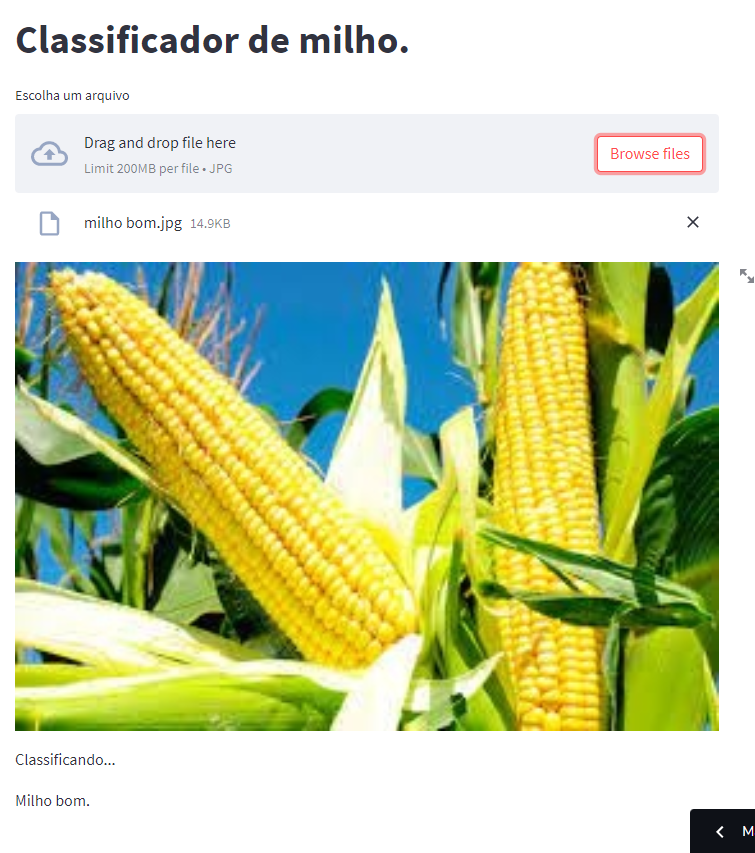
