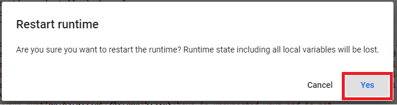
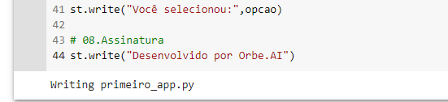
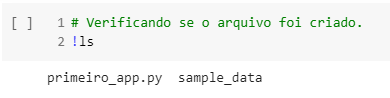
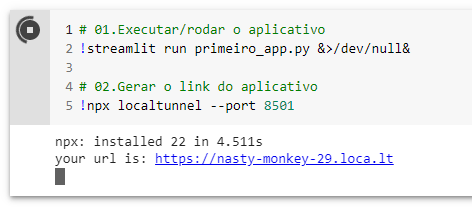
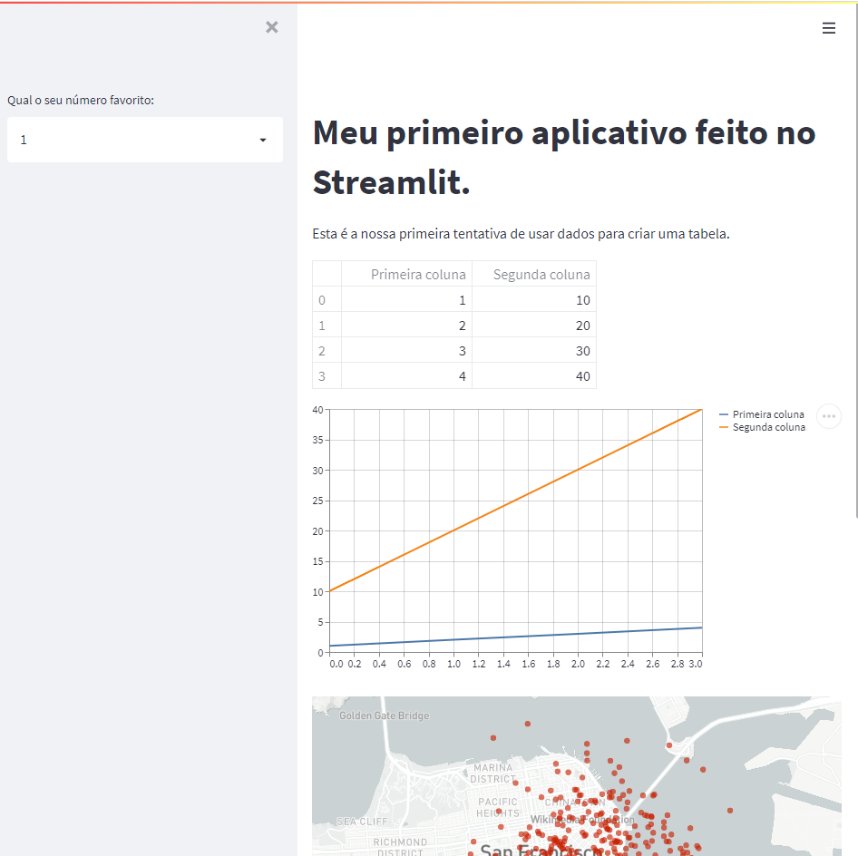

Introdução
****

.. image:: images/streamlit/Logo.png
   :align: center
   :width: 550

01.O que é Streamlit
====

- Streamlit é uma biblioteca em Python que nos permite criar aplicativos web personalizados para ciência de dados e inteligência artificial em poucos minutos.

- Ideal para tirar ideias de projetos do papel e poder testar e apresentar para outras pessoas do seu trabalho e para clientes.

- Para desenvolver nosso aplicativo temos que seguir os seguintes passos:

 - Instalar o Streamlit.
 - Criar o aplicativo - escrever o código (programação) do aplicativo.
 - Executar o aplicativo.

- Clique aqui para acessar o site oficial do Streamlit : https://streamlit.io/

02.Instalando o Streamlit
====

- Usualmente é usado uma **IDE** (software para programação) para programar um aplicativo no Streamlit. Mas como já estamos acostumados com o Jupyter Notebook vamos programar por aqui. Para isso temos que seguir alguns passos:

 - Instalar o Streamlit.
 - Escrever o código (programação) do aplicativo.
 - Executar o aplicativo.

02.a.Como instalar o Streamlit.
----

- Para instalar uma biblioteca usamos o comando `!pip install nome_da_biblioteca` desta forma:

.. code-block:: python
   :linenos:

    !pip install streamlit

.. warning:: 

   Logo após a instalação do Streamlit, no *output* da célula de código, irá aparecer um botão escrito *Restart Runtime* (reiniciar o tempo de execução), clique neste botão e depois no botão *Yes* (sim).
   
.. image:: images/streamlit/restart_runtime.png
   :align: center
   :width: 550

03.Criar o aplicativo
====

- Para criar um aplicativo com o Streamlit, temos que seguir os seguintes passos:

 - 01.Criar um arquivo Python (que terá a programação do aplicativo).
 - 02.Programar o aplicativo - escrever o código (programação) do aplicativo.
 - 03.Conferir se o arquivo foi criado.
 
03.a.Criando o arquivo Python
----

- Para criar o arquivo  Python usamos o comando `%%writefile` desta maneira:

.. code-block:: python
   :linenos:

    %%writefile nome_do_arquivo.py

- Neste primeiro app vamos criar um arquivo chamado **primeiro_app**, então ficará assim:

.. code-block:: python
   :linenos:

    %%writefile primeiro_app.py

- Para não criar um arquivo vazio, vamos adicionar os primeiros comandos, que no caso é a importação das bibliotecas que iremos usar e um título no aplicativo.

.. code-block:: python
   :linenos: 

    %%writefile primeiro_app.py

    import streamlit as st
    import pandas as pd

    st.title("Meu primeiro aplicativo feito no Streamlit.")

Caso queira conhecer mais as ferramentas e funcionalidades do Streamlit, veja os links a seguir:

- Como fazer cada um dos elementos que compõe um site: 
    - https://docs.streamlit.io/en/stable/api.html#display-interactive-widgets

- Resumo de todos os comandos: 
    - https://share.streamlit.io/daniellewisdl/streamlit-cheat-sheet/app.py

Vamos mais adiante em nosso exemplo e desenvolver o nosso primeiro aplicativo:

.. code-block:: python
   :linenos: 

    # Criando o arquivo em Python
    %%writefile primeiro_app.py

    # Importando as bibliotecas necessárias
    import streamlit as st
    import pandas as pd
    import numpy as np

    # 01.Título do aplicativo.
    st.title("Meu primeiro aplicativo feito no Streamlit.")

    # 02.Escrever um sub-título
    st.write("Esta é a nossa primeira tentativa de usar dados para criar uma tabela.")

    # 03.Criando um DataFrame/tabela de dados.
    df = pd.DataFrame({
        'Primeira coluna': [1,2,3,4],
        'Segunda coluna':[10,20,30,40]
    })

    df

    # 04.Criando um gráfico de linha
    st.line_chart(df)

    # 05.Criar um mapa.
    mapa = pd.DataFrame(
        np.random.randn(1000, 2) / [50, 50] + [37.76, -122.4],
        columns=['lat','lon']
    )
    st.map(mapa)

    # 06.Caixa de seleção.
    if st.checkbox("Mostre um texto:"):
      st.write("Você selecionou a caixa de seleção.")

    # 07.Criando uma barra lateral.
    opcao = st.sidebar.selectbox('Qual o seu número favorito:', df['Primeira coluna'])
    st.write("Você selecionou:",opcao)

    # 08.Assinatura
    st.write("Desenvolvido por Orbe.AI")
    

Ao rodar a célula de criação do arquivo primeiro_app.py irá exibir este resultado:

   
03.b.Conferir se o arquivo foi criado.
----

- Para conferir se o arquivo foi criado podemos olhar na barra lateral **ARQUIVOS** ou usamos o comando `!ls` desta forma:

.. code-block:: python
   :linenos: 

    # Verificando se o arquivo foi criado.
    !ls

O resultado ao rodar o comando !ls será esse:

   

04.Visualizar o aplicativo
====

- Para visualizar o aplicativo precisamos executar o seguinte comando:

.. code-block:: python
   :linenos: 

    !streamlit run nome_do_aplicativo.py &>/dev/null&

    !npx localtunnel --port 8501

* Certifique-se de alterar onde está `nome_do_aplicativo.py` pelo nome de seu arquivo

O resultado será esse:

   
- Esta célula não pode parar de rodar para o site continuar funcionando, caso contrário irá apresentar `Error 404`

- Cada vez que fizermos ou adicionarmos uma alteração no código do aplicativo, precisaremos executar novamente esta célula de código para gerar o link do site.
  - Lembre-se de clicar em *stop* antes de executar novamente esta célula de código para gerar o link do site.
  
.. warning::

   Após gerar o link do aplicativo, será criado uma nova aba no navegador, entre nesta nova aba e clique no botão *Click to continue* (clique para continuar). Logo em seguida irá aparecer o aplicativo criado.

.. image:: images/streamlit/click_to_continue.png
   :align: center
   :width: 550
   
Aqui está o resultado de seu primeiro aplicativo com Streamlit:

