Teachable Machine e Streamlit
****

01.Compreensão do negócio
====

- Definal qual o **problema de classificação** do seu projeto.
- Defina quais são as **classes a serem preditas** no seu projeto.

- Exemplo:

 - **Problema:**
    - **Classe 01:** Milho ruim
    - **Classe 02:** Milho bom
    
02.Treinar o modelo de classificação
====

- Para treinar e obter o modelo de classificação, vamos usar o site do *Teachable Machine* e realizar os seguintes passos:

1.Entre no site do Teachable Machine: https://teachablemachine.withgoogle.com

2.Clique no botão **começar** (*get started*).

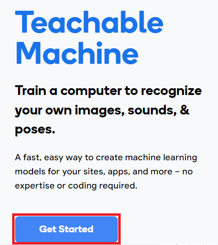

3.Em NOVO PROJETO selecione a opção **Projeto de imagem.** (*image project*).

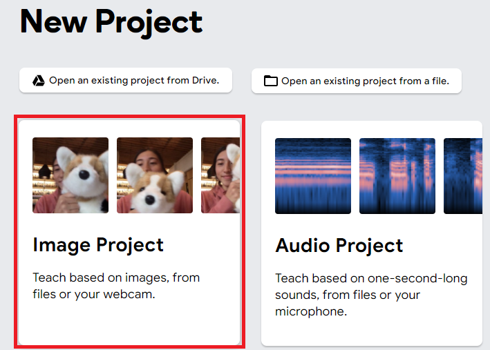

4.Selecione a opção **modelo de imagem padrão** (*Stardard image model*).

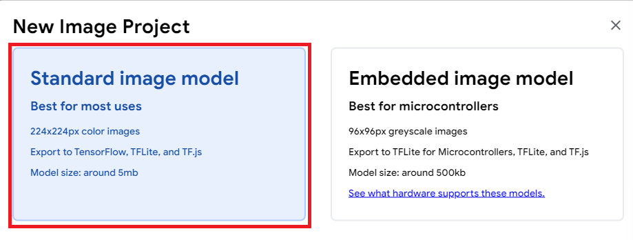

5.Treine o seu modelo com as imagens necessárias.

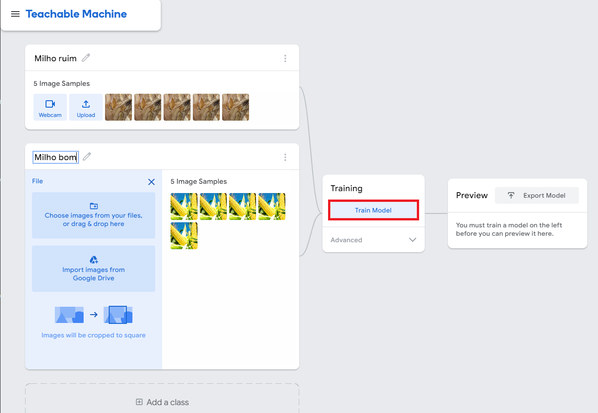

.. warning:: 

  Atenção, este é apenas um exemplo que preparamos para você. 
  O recomendado na hora de treinar o seu modelo é subir o máximo de imagens possíveis para o modelo ter uma melhor acurácia.

6.Exporte o modelo clicando no botão **exportar modelo** (*Export Model*), em seguida na aba **Tensorflow** e por fim clique no botão **Transferir o meu modelo** (*download my model*).

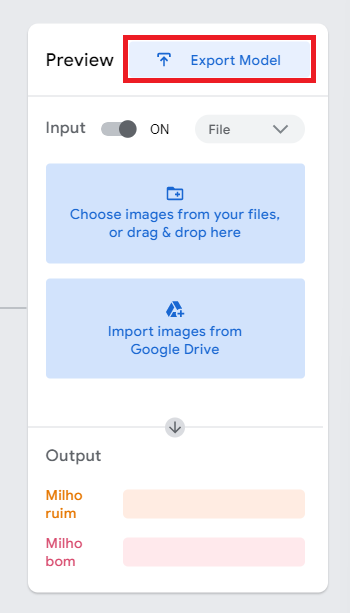

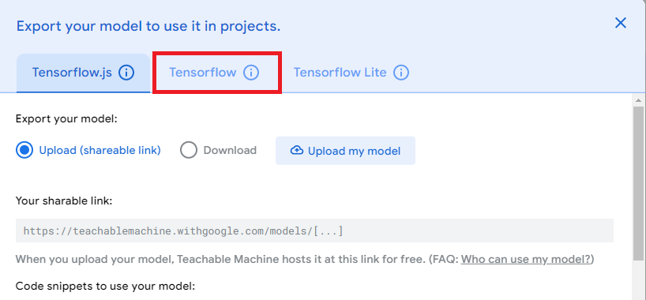

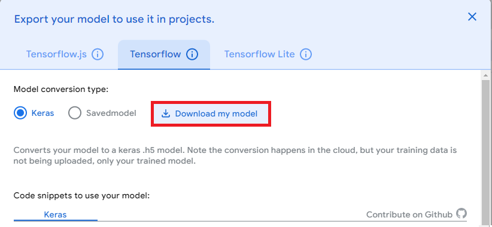

7.Após o *download*, transfira o arquivo do modelo (keras_model.h5) para a área de arquivos no Google Colab (assim como fazemos com os *datasets*).

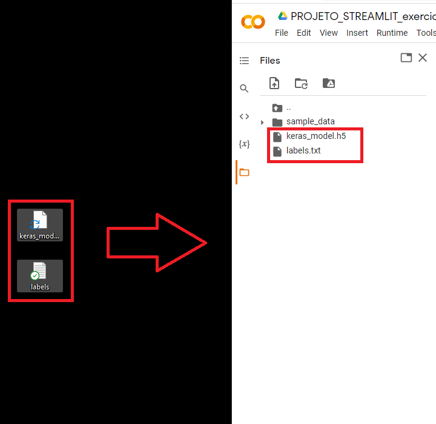

.. warning:: 

  O arquivo vem **"zipado"** do *download*, primeiro retire o arquivo do modelo (keras_model.h5) da pasta **"zipada"** e só depois inclua o arquivo (keras_model.h5) na área de arquivos do Google Colab na lateral esquerda.
  
03.Instalando as bibliotecas necessárias
=====

- Para este projeto precisamos instalar as seguintes bibliotecas:

  - **numpy** - para trabalhar com números.
  - **pillow** -  para trabalhar com imagens.
  - **tensorflow** - para trabalhar com inteligênicia artificial.
  - **keras** - para trabalhar com inteligênicia artificial.
  -  **streamlit** - para criar o aplicativo.

.. code-block:: python
   :linenos:

    !pip install numpy
    !pip install pillow
    !pip install tensorflow
    !pip install keras
    !pip install streamlit

* Lembre-se de clicar em **RESTART RUNTIME** ao instalar o Streamlit

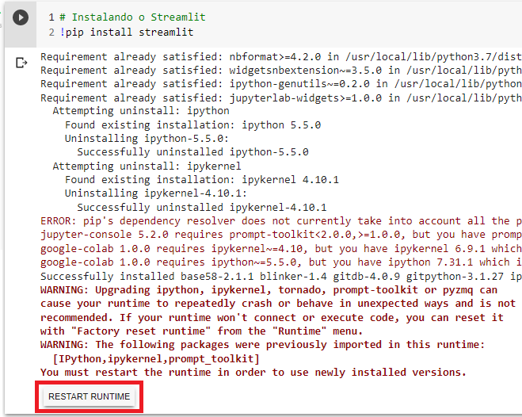
   

04.Criar um arquivo para classificar as imagens
=====

04.a.Descrição
----

- 04.a.I.Use o comando `%%writefile` para criar o arquivo chamado `arquivo_classificador_de_imagem.py`.

- 04.a.II.Preparar a classificação de imagem.

  * Importar as bibliotecas necessárias.
  
.. code-block:: python
   :linenos:
   
    import tensorflow.keras
    from PIL import Image, ImageOps
    import numpy as np
   
  * Crie a função `funcao_classificar_imagem()` que tenha os parâmentros `img`, `keras_model` e que tenha como retorno `return np.argmax(prediction)`.

    - Copie e cole o código gerado pelo ***Teachable Machine***.

    - Adequar na função:
     - Identação do código adicionado dentro da função.
     - Endereço da imagem a ser classificada.

- 04.a.III.Adicionar o modelo de classificação (`keras_model.h5`) na área de arquivos do Google Colaboratory.

04.b.Código do arquivo
----

Ao seguir as instruções acima, seu código irá ficar assim: 

.. code-block:: python
   :linenos:

    # CRIAR ARQUIVO DE CLASSIFICAÇÃO.

    # 01.Criar o arquivo.
    %%writefile arquivo_classificador_de_imagem.py

    import tensorflow
    from keras.models import load_model
    from PIL import Image, ImageOps
    import numpy as np

    def funcao_classificar_imagem(img, keras_model):

      # Disable scientific notation for clarity
      np.set_printoptions(suppress=True)

      # Load the model
      model = load_model('keras_model.h5')

      # Create the array of the right shape to feed into the keras model
      # The 'length' or number of images you can put into the array is
      # determined by the first position in the shape tuple, in this case 1.
      data = np.ndarray(shape=(1, 224, 224, 3), dtype=np.float32)

      # Replace this with the path to your image
      image = img

      #resize the image to a 224x224 with the same strategy as in TM2:
      #resizing the image to be at least 224x224 and then cropping from the center
      size = (224, 224)
      image = ImageOps.fit(image, size, Image.ANTIALIAS)

      #turn the image into a numpy array
      image_array = np.asarray(image)

      # display the resized image
      image.show()

      # Normalize the image
      normalized_image_array = (image_array.astype(np.float32) / 127.0) - 1

      # Load the image into the array
      data[0] = normalized_image_array

      # run the inference
      prediction = model.predict(data)
      print(prediction)

      return np.argmax(prediction)

Ao executar este código irá exibir o seguinte resultado:

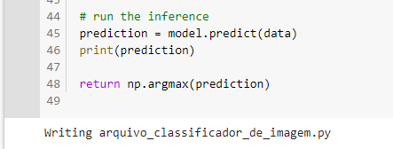

05.Criar o aplicativo com Streamlit
====

05.a.Descrição
----

- 05.a.I.Use o comando `%%writefile` para criar o arquivo chamado `arquivo_aplicativo_de_classificacao.py`

- 05.a.II.Importar a função `funcao_classificar_imagem` e as bibliotecas necessárias:

.. code-block:: python
   :linenos:

    from arquivo_classificador_imagem import funcao_classificar_imagem
    import streamlit as st
    from PIL import Image

- 05.a.III.Criar os elementos que compõem o aplicativo:

 - Lembre-se de trocar o nome das suas classes a serem preditas.
 
05.b.Código do aplicativo
----

Ao seguir as instruções acima, seu código irá ficar assim: 

.. code-block:: python
   :linenos:

    # CRIAR ARQUIVO DO APLICATIVO.
    # 01.Criar o arquivo chamado arquivo_aplicativo_de_classificacao.py.
    %%writefile arquivo_aplicativo_de_classificacao.py

    # 02.Importar a função funcao_classificar_imagem e as bibliotecas necessárias.
    from arquivo_classificador_de_imagem import funcao_classificar_imagem
    import streamlit as st
    from PIL import Image

    # 03.Criar os elementos que compõe o aplicativo.
    # TÍTULO DO SITE.
    st.title("Classificador de milho.")
    
    # BOTÃO PARA FAZER UPLOAD DA IMAGEM A SER CLASSIFICADA.
    uploaded_file = st.file_uploader("Escolha um arquivo", type="jpg")
    
    # CLASSIFICAÇÃO DA IMAGEM.
    if uploaded_file is not None:
    
        # ABRIR A IMAGEM CARREGADA.
        image = Image.open(uploaded_file)
    
        # MOSTRAR A IMAGEM.
        st.image(image, caption='', use_column_width=True)
    
        # TEXTO INDICANDO QUE A IMAGEM ESTÁ SENDO CLASSIFICADA.
        st.write("Classificando...")
    
        # CHAMAR A FUNÇÃO DE CLASSIFICAÇÃO DE IMAGEM
        # E ARMAZENAR O RESULTADO NA VARIÁVEL LABEL.
        label = funcao_classificar_imagem(image, 'keras_model.h5')
    
        # CONDICIONAL PARA IDENTIFICAR A CLASSE DA IMAGEM.
        if label == 1:
    
            # INSIRA O NOME DA PRIMEIRA CLASSE.
            st.write("Milho bom.")
    
        else:
    
          # INSIRA O NOME DA SEGUNDA CLASSE.
            st.write("Milho ruim.")

Ao executar este código irá exibir o seguinte resultado:

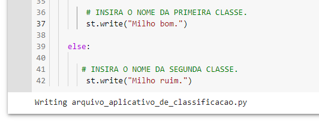
   

06.Visualizar o aplicativo
====

- Para visualizar o aplicativo precisamos executar o seguinte comando:

.. code-block:: python
   :linenos: 

    !streamlit run arquivo_aplicativo_de_classificacao.py &>/dev/null&

    !npx localtunnel --port 8501

.. warning::

    Após gerar o link do aplicativo, será criado uma nova aba no navegador, entre nesta nova aba e clique no botão *Click to continue* (clique para continuar). Logo em seguida irá aparecer o aplicativo criado.

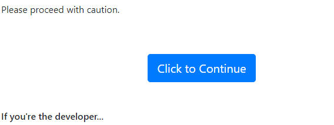
 
 
Após rodar a célula ele irá gerar um link:

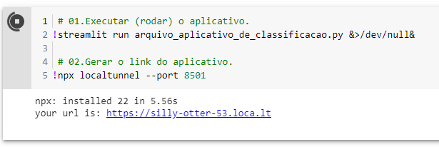

E aqui está nosso aplicativo com classificação de imagens:

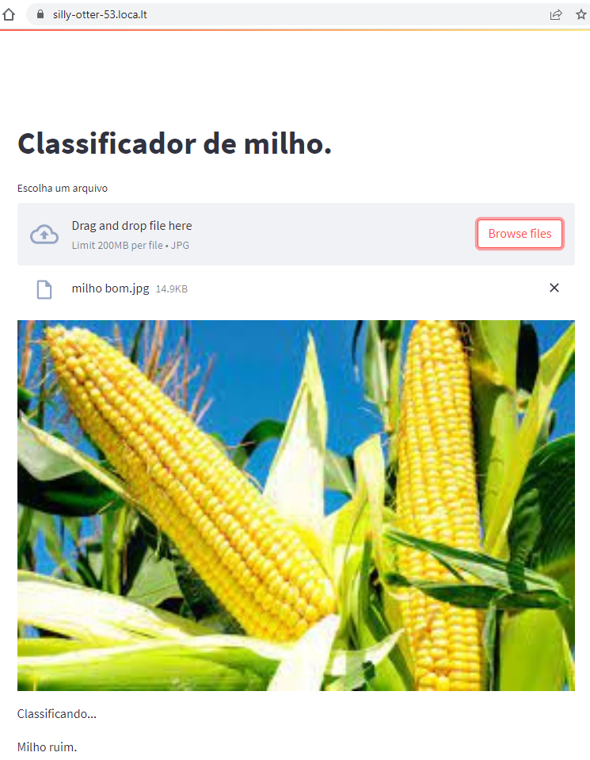

Caso a gente rode com outra classe:

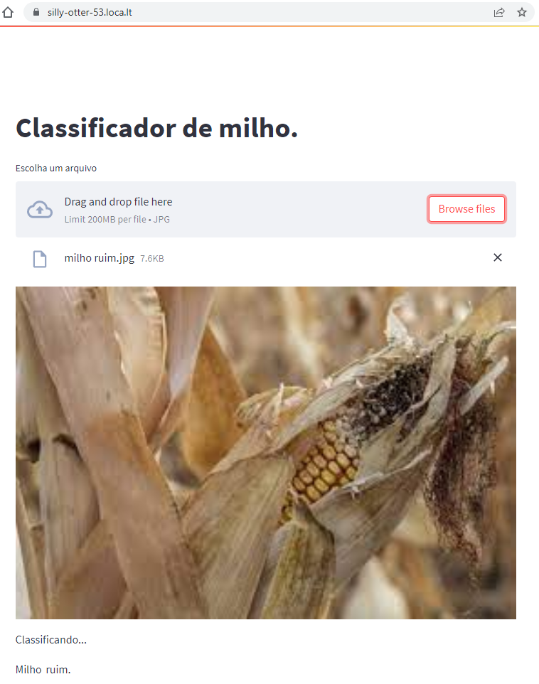

